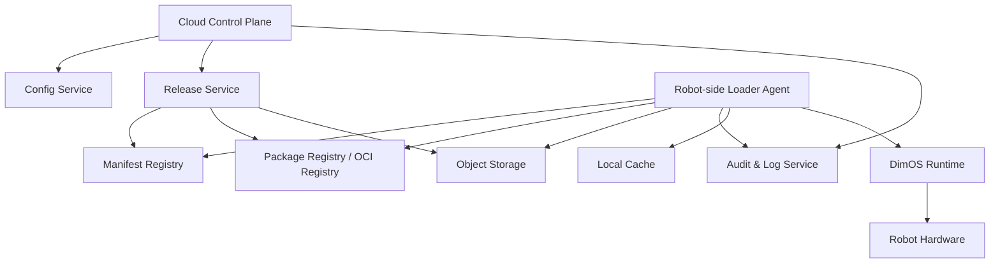
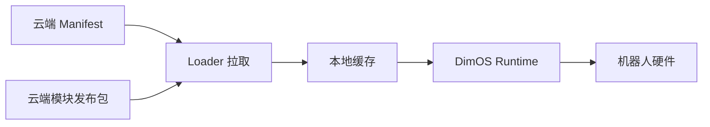
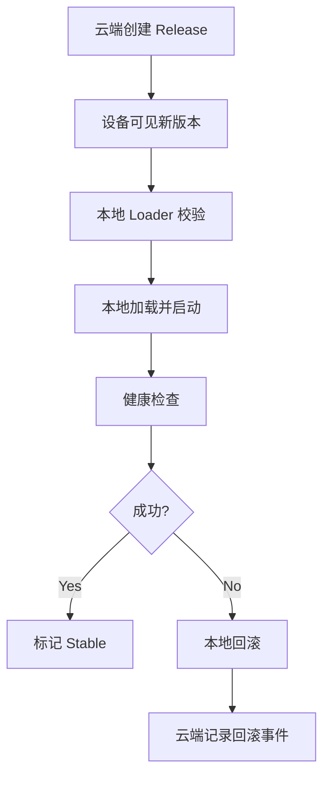

# DimOS 云端化总体方案白皮书

## 1. 文档目标

本文档用于把此前分散的 DimOS 云端化相关设计整合成一份总体方案说明。

目标是回答以下问题：

- 为什么 DimOS 需要云端化能力
- 云端化之后的总体架构是什么
- 云端和机器人本地分别负责什么
- 配置、模块发布包、Manifest、Loader、发布和回滚之间如何协同
- 这条演进路线为什么合理

本文档只讨论方案设计，不涉及实现代码。

## 2. 背景

DimOS 当前本质上是一个本地运行时平台。

它的核心能力是：

- 用 `Module` 封装能力单元
- 用 `Blueprint` 装配系统
- 用 `ModuleCoordinator` 统一管理运行
- 用 `Stream / RPC / Spec` 让模块协作

这套体系非常适合本地运行，但当系统规模扩大后，会遇到新的管理问题：

- 不同机器人需要不同配置
- 机器人本地手工改配置成本高
- 模块版本、模型版本和运行版本难统一
- 故障后的回滚缺少统一机制
- 缺乏集中审计和发布控制

因此，需要在不破坏 DimOS 本地运行优势的前提下，引入云端管理能力。

## 3. 总体目标

DimOS 云端化的目标不是把机器人控制迁到云端，而是：

> 在保留机器人本地运行和本地控制的前提下，让云端统一管理配置、模块发布包、版本、发布和回滚。

因此，云端化的目标是：

- 配置集中管理
- 发布包统一分发
- 版本可追踪
- 发布可控制
- 失败可回滚
- 系统可审计

## 4. 核心原则

方案必须遵循以下原则：

### 4.1 本地运行原则

DimOS 运行时、模块启动、实时控制、健康检查和回滚执行，都应在机器人本地或边缘节点完成。

### 4.2 云端控制面原则

云端负责：

- 配置管理
- 发布管理
- 版本管理
- 审计与状态汇总

而不负责实时控制环。

### 4.3 数据契约原则

云端与本地之间，必须通过稳定的 Manifest 数据契约协同，而不是依赖临时参数拼接。

### 4.4 发布包原则

云端下发的应是“版本化模块发布包”和“版本化配置”，而不是任意代码片段。

### 4.5 可回滚原则

任何发布流程都必须具备本地回滚能力，且回滚优先依赖本地缓存。

## 5. 云端化总体架构

## 6. 架构分层说明

### 6.1 云端控制面

负责：

- 管理配置版本
- 管理模块发布包版本
- 管理发布策略
- 管理设备状态
- 记录发布和回滚事件

### 6.2 本地加载控制层

由 `Robot Loader Agent` 承担，负责：

- 拉取 Manifest
- 下载发布包
- 缓存本地版本
- 启动 DimOS
- 健康检查
- 回滚稳定版本
- 向云端汇报状态

### 6.3 本地运行时层

由 DimOS 本身承担，负责：

- 解析 `Blueprint`
- 启动 `Module`
- 建立 `Stream / RPC / Spec` 协作关系
- 与真实机器人硬件交互

## 7. 关键对象关系

整个云端化体系围绕四个核心对象展开：

### 7.1 配置

回答的问题是：

- 这台机器人应该怎么运行
- 使用哪个 blueprint
- 全局参数怎么配置

### 7.2 模块发布包

回答的问题是：

- 这次运行要依赖哪些模块内容
- 这些模块如何被下载和缓存
- 版本和校验信息是什么

### 7.3 Manifest

回答的问题是：

- 一次完整运行发布由哪些部分组成
- 目标设备是谁
- 运行环境边界是什么
- 如何健康检查
- 如何回滚

### 7.4 Release

回答的问题是：

- 哪个 Manifest 被发布到哪些机器人
- 发布状态是什么
- 是否成功，是否触发回滚

## 8. 数据流与控制流

### 8.1 数据流

### 8.2 控制流

## 9. Manifest 的角色

Manifest 是云端与本地协作的核心契约。

它负责描述：

- 发布版本是谁
- 面向哪些设备
- 使用哪个 blueprint
- 依赖哪些模块发布包
- 依赖哪些模型和资源
- 健康检查规则是什么
- 回滚策略是什么

所以 Manifest 的角色，不是简单配置文件，而是“本地部署与运行的标准描述文件”。

## 10. Robot Loader Agent 的角色

Robot Loader Agent 是整个云端化体系的本地执行入口。

它不替代 DimOS Runtime，而是为 DimOS 增加：

- 本地拉取能力
- 本地版本管理能力
- 本地启动与停止能力
- 本地健康检查能力
- 本地回滚能力

一句话说：

> Loader 是本地发布控制器，DimOS 是本地运行时。

## 11. 发布包管理的角色

在云端化体系中，发布包管理负责解决“运行内容如何分发”的问题。

它包括：

- OCI 镜像
- Python wheel 包
- 模型 / 数据 Blob

作用是：

- 提供可版本化的运行内容
- 支持下载、校验、缓存和复用
- 把模块和资源从本地固化内容转变为可发布内容

## 12. 回滚体系的角色

回滚体系是这个方案能否落地的关键。

设计上必须明确：

- 回滚执行在本地
- 回滚依据来自本地稳定版本缓存
- 回滚记录既要本地保存，也要上报云端

如果没有本地回滚能力，那么：

- 新版本失败时机器人可能无法恢复
- 断网时无法依赖云端纠正问题

因此，回滚不是辅助功能，而是核心能力。

## 13. 云端存储的职责划分

云端存储建议分成四层：

### 13.1 元数据层

负责：

- 设备信息
- 发布记录
- 版本关系
- Manifest 元数据
- 回滚事件

### 13.2 发布包仓库层

负责：

- 容器镜像
- 可运行模块包

### 13.3 对象存储层

负责：

- wheel 包
- 模型
- 地图
- URDF / MJCF
- replay 数据
- 日志归档

### 13.4 审计层

负责：

- 发布审计
- 拉取审计
- 失败审计
- 回滚审计

## 14. 为什么这条路线合理

这条路线合理，主要因为它兼顾了两件事：

### 14.1 保留 DimOS 原有优势

DimOS 原本的优势是：

- 本地运行稳定
- 运行链清晰
- 模块化装配明确
- 不依赖云端在线参与控制

云端化方案没有破坏这些基础。

### 14.2 补齐规模化部署短板

云端化补齐了这些能力：

- 配置集中管理
- 发布统一管理
- 版本追踪
- 健康检查闭环
- 自动回滚
- 审计和运维可视化

因此，这不是重做一套系统，而是在 DimOS 之上补一层可管理、可发布、可回滚的外壳。

## 15. 推荐演进顺序

云端化不应该一步到位，而应分阶段推进：

### 第一阶段：云端配置加载

目标：

- 先把配置集中管理起来

### 第二阶段：本地 Loader 建设

目标：

- 建立本地发布控制与回滚能力

### 第三阶段：模块发布包管理

目标：

- 支持镜像、wheel、模型、资源的标准化分发

### 第四阶段：发布 / 回滚 API

目标：

- 把部署和回滚做成统一控制面

### 第五阶段：灰度与审计

目标：

- 形成稳定的规模化运维闭环

## 16. 风险与注意事项

需要重点注意以下风险：

- 云端和本地职责不清，导致控制链混乱
- 没有 Manifest 契约，导致发布不可复现
- 没有本地缓存，导致回滚依赖网络
- 没有版本边界，导致不兼容发布
- 没有签名和白名单，导致安全风险

## 17. 总结

DimOS 云端化的正确方向，不是把机器人控制迁到云端，而是：

> 让云端负责管理，让本地负责运行。

其核心闭环是：

- 云端定义配置和发布包
- Manifest 描述一次完整发布
- Loader 在本地拉取、校验、缓存、启动
- DimOS 在本地运行机器人系统
- 健康检查失败时本地回滚
- 云端记录全过程并统一管理

这条路线既符合 DimOS 现有架构，也适合把 DimOS 逐步演进成一个可被云端安全发布和管理的机器人运行平台。
