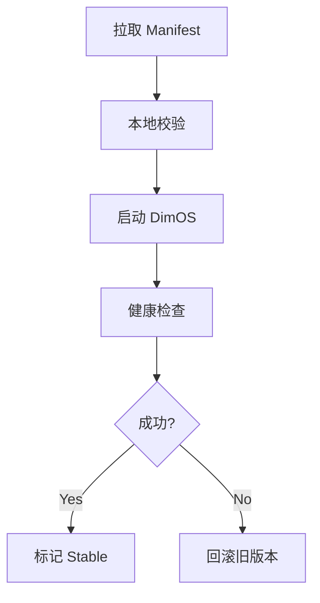

# DimOS 云端化实施路线图

## 1. 文档目标

本文档用于把此前的云端化方案进一步转化为一条可执行的实施路线。

目标是回答：

- 应该按什么顺序推进
- 每个阶段做什么
- 每个阶段的输出是什么
- 各阶段之间有什么依赖
- 如何判断一个阶段是否完成

本文档只讨论实施规划，不涉及具体实现代码。

## 2. 总体实施原则

DimOS 云端化不适合一次性做完，而应按“先建立最小闭环，再逐步扩展能力”的方式推进。

建议遵循以下原则：

- 先配置，后发布包
- 先本地控制闭环，后云端批量管理
- 先可运行，后可规模化
- 先可回滚，后可灰度
- 先建立数据契约，后扩展实现细节

## 3. 总体阶段划分

建议分为 6 个阶段：

1. 基础约束与数据契约阶段
2. 云端配置中心阶段
3. 本地 Loader 最小闭环阶段
4. 模块发布包分发阶段
5. 发布 / 回滚控制面阶段
6. 灰度发布与运维审计阶段

## 4. 阶段 1：基础约束与数据契约

### 4.1 目标

先把云端和本地之间的“数据契约”和“术语体系”定清楚，避免后续反复返工。

### 4.2 核心工作

- 确认 Manifest 的顶层结构
- 明确 Schema 版本策略
- 统一“模块发布包 / Manifest / Release / Stable / Rollback”等术语
- 确定目标设备字段、兼容性字段、健康检查字段、回滚字段

### 4.3 交付物

- Manifest JSON Schema 方案文档
- 云端发布包分类与存储映射文档
- 云端化总体白皮书

### 4.4 完成标准

- Manifest 字段边界清晰
- 术语在文档内统一
- 核心对象关系不再反复调整

### 4.5 当前状态

这一阶段已基本完成，现有分析文档已经覆盖。

## 5. 阶段 2：云端配置中心

### 5.1 目标

先实现“云端配置加载”，不急着做完整模块发布包体系。

### 5.2 核心工作

- 建立配置中心
- 支持存储和查询 Manifest
- 支持按设备或标签下发配置
- 支持配置版本管理
- 支持配置历史记录

### 5.3 最小范围

本阶段只解决：

- 云端配置如何定义
- 本地如何拉取配置
- 如何根据配置启动本地 DimOS

不解决：

- 模块镜像自动分发
- wheel 包自动安装
- 复杂灰度发布

### 5.4 交付物

- 配置中心服务
- 配置查询 API
- 配置版本表
- 一份可被本地 Loader 拉取的标准 Manifest

### 5.5 验收标准

- 指定设备能拉取到目标 Manifest
- Manifest 能驱动本地运行
- 配置历史可追溯

## 6. 阶段 3：本地 Loader 最小闭环

### 6.1 目标

先在机器人本地建立一个完整闭环：

- 拉取配置
- 启动运行
- 健康检查
- 失败回滚

### 6.2 核心工作

- 实现 Loader 状态机
- 实现本地状态持久化
- 实现 RuntimeController
- 实现 HealthChecker
- 实现 RollbackManager

### 6.3 最小闭环流程

### 6.4 交付物

- 本地 Loader Agent
- 本地状态文件
- 本地回滚逻辑
- 本地缓存目录结构

### 6.5 验收标准

- 新配置可自动启动
- 启动失败可回滚
- 回滚后系统可恢复运行
- 本地状态可查询

## 7. 阶段 4：模块发布包分发

### 7.1 目标

在配置拉取能力稳定后，再引入“运行内容分发”。

### 7.2 核心工作

- 建立 OCI Registry 接入
- 建立对象存储接入
- 支持发布包下载与缓存
- 支持镜像、wheel、Blob 的统一引用
- 建立校验机制

### 7.3 推荐优先级

优先顺序建议：

1. Docker 镜像
2. 模型 / 数据 Blob
3. Python wheel 包

因为 Docker 镜像与当前 DimOS 的现有能力最接近。

### 7.4 交付物

- 发布包下载器
- 本地缓存管理器
- 发布包校验逻辑
- 发布包与 Manifest 对接机制

### 7.5 验收标准

- Loader 能根据 Manifest 拉取缺失发布包
- 下载后能完成本地缓存
- 校验失败的发布包不会被加载

## 8. 阶段 5：发布 / 回滚控制面

### 8.1 目标

把“单机器人本地闭环”提升为“云端统一发布与回滚”。

### 8.2 核心工作

- 实现 Release 创建 API
- 实现 Release 部署 API
- 实现设备状态查询 API
- 实现回滚 API
- 上报部署结果与回滚事件

### 8.3 交付物

- Release Service
- 部署 API
- 回滚 API
- 状态查询 API
- 审计事件表

### 8.4 验收标准

- 云端可对单设备触发发布
- 云端可查询设备当前 release
- 云端可触发回滚
- 发布和回滚结果可追踪

## 9. 阶段 6：灰度发布与运维审计

### 9.1 目标

在基本发布和回滚能力稳定后，增强运维与规模化能力。

### 9.2 核心工作

- 支持按标签分批发布
- 支持滚动发布
- 支持发布失败自动暂停
- 支持发布稳定性统计
- 支持审计检索和回滚分析

### 9.3 交付物

- 灰度发布策略
- 批量发布控制能力
- 审计看板
- 失败分析报表

### 9.4 验收标准

- 能对一组机器人做灰度发布
- 失败比例超过阈值时自动停止发布
- 审计链条完整

## 10. 阶段之间的依赖关系

说明：

- 阶段 1 是基础
- 阶段 2 和 3 构成第一条最小可用主线
- 阶段 4 开始引入真正的运行内容分发
- 阶段 5 和 6 负责把系统提升到可管理、可规模化状态

## 11. 推荐最小落地路径

如果资源有限，不要一次性做全量。

建议优先打通这条最小路径：

1. Manifest 定义完成
2. 云端配置中心上线
3. 本地 Loader 能拉取 Manifest
4. 本地能启动 / 健康检查 / 回滚

这条路径一旦打通，就已经具备：

- 云端配置下发
- 本地自动运行
- 本地失败恢复

它是整个云端化方案中最重要的第一条业务闭环。

## 12. 每阶段的关键风险

### 阶段 1 风险

- 契约字段反复变更
- 术语不统一

### 阶段 2 风险

- Manifest 定义和本地运行参数脱节
- 版本管理粒度不清

### 阶段 3 风险

- Loader 没有真正独立状态机
- 健康检查不足，导致假成功
- 回滚依赖云端而不是本地缓存

### 阶段 4 风险

- 发布包种类过早做太多
- 校验机制不足
- 本地缓存策略不清晰

### 阶段 5 风险

- API 语义不统一
- 云端控制面和本地执行边界混淆

### 阶段 6 风险

- 在基础能力不稳时过早做灰度
- 审计口径不统一

## 13. 推荐项目组织方式

实施推进时，建议按三条主线并行组织：

### 13.1 契约与控制面主线

负责：

- Manifest
- Release 模型
- API 设计

### 13.2 本地执行主线

负责：

- Loader
- RuntimeController
- HealthChecker
- RollbackManager

### 13.3 发布包与存储主线

负责：

- Registry
- 对象存储
- 下载与缓存
- 校验机制

## 14. 最终目标图景

当 6 个阶段全部完成后，DimOS 将具备：

- 云端统一配置管理
- 云端统一发布管理
- 本地稳定运行
- 本地自动健康检查
- 本地自动回滚
- 模块发布包标准化分发
- 发布全过程审计
- 批量与灰度运维能力

这时，DimOS 就不只是一个本地机器人运行时，而会演化为：

> 一个可被云端安全发布、统一管理、可回滚、可审计的机器人运行平台。

## 15. 结论

DimOS 云端化最合理的推进方式，不是并行无序扩展，而是：

- 先把契约定下来
- 再做配置中心
- 再建立本地 Loader 闭环
- 再引入模块发布包分发
- 再做统一发布与回滚 API
- 最后扩展灰度与审计能力

这条路线能最大程度降低返工风险，并保证每一阶段都能形成可验证的结果。
