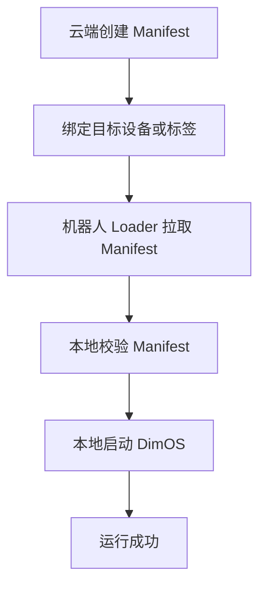
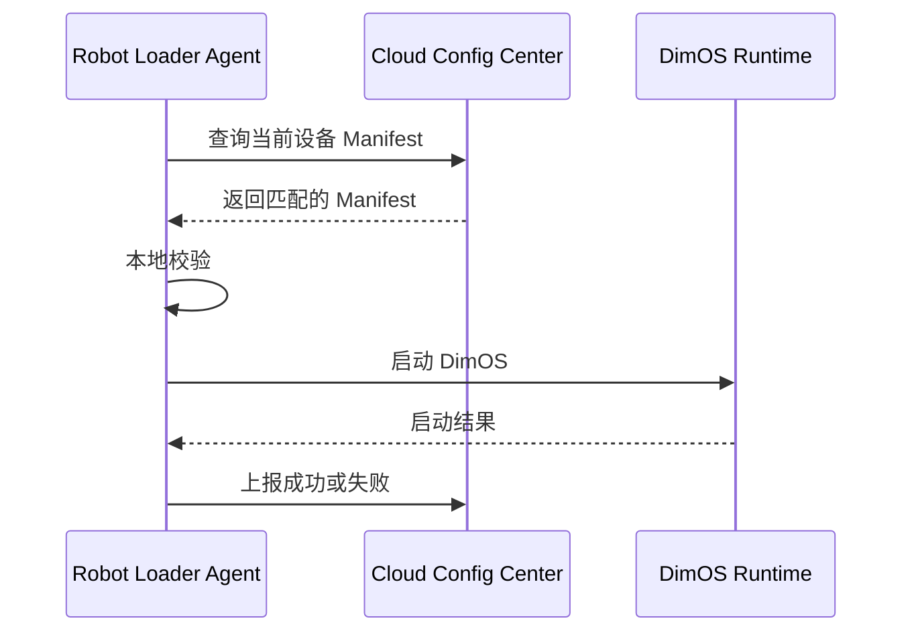

# DimOS 阶段 2：云端配置中心详细方案

## 1. 文档目标

本文档用于细化 `DimOS 云端化实施路线图` 中的“阶段 2：云端配置中心”。

目标是明确：

- 云端配置中心的职责边界
- 它与 Manifest、Loader、DimOS Runtime 的关系
- 配置中心最小可落地闭环是什么
- 需要哪些核心对象、接口和存储结构
- 如何判断阶段 2 完成

本文档只讨论方案设计，不涉及实现代码。

## 2. 阶段定位

云端配置中心是整个云端化体系的第一个真正可运行控制面。

它的任务不是分发所有运行内容，而是先解决：

- 配置如何集中管理
- Manifest 如何统一定义
- 机器人如何拉取配置
- 本地如何基于配置启动 DimOS

一句话说：

> 阶段 2 的目标，是先把“配置管理闭环”跑通，再去做更重的发布包分发。

## 3. 职责边界

### 3.1 云端配置中心负责什么

云端配置中心负责：

- 保存 Manifest
- 保存配置版本
- 提供配置查询能力
- 提供按设备或标签匹配配置的能力
- 提供配置历史追踪能力
- 记录配置发布和变更信息

### 3.2 云端配置中心不负责什么

在阶段 2 中，不负责：

- 自动分发 Docker 镜像
- 自动安装 wheel 包
- 批量灰度发布
- 复杂回滚策略编排
- 云端实时控制机器人

这些能力属于后续阶段。

## 4. 与其他组件的关系

### 4.1 与 Manifest 的关系

配置中心保存和提供的核心对象就是 Manifest。

Manifest 在这个阶段主要承载：

- 目标设备约束
- blueprint 入口
- global_config
- 基本健康检查规则
- 基本回滚信息

### 4.2 与 Robot Loader Agent 的关系

Robot Loader Agent 是配置中心的直接消费者。

它从配置中心：

- 查询最新 Manifest
- 拉取目标配置
- 本地校验
- 启动 DimOS

### 4.3 与 DimOS Runtime 的关系

配置中心不直接启动 DimOS。  
真正的启动动作仍由 Loader 在本地完成。

## 5. 最小闭环目标

阶段 2 需要打通的最小业务闭环是：



也就是说，阶段 2 的最小成功标准不是“云端全量发布平台”，而是：

- 云端有标准化配置
- 本地能拉取配置
- 本地能据此启动系统

## 6. 核心对象设计

建议阶段 2 至少定义以下对象：

### 6.1 Device

表示机器人设备。

建议字段：

- `device_id`
- `robot_type`
- `arch`
- `os`
- `labels`
- `status`
- `last_seen_at`

### 6.2 Manifest

表示一份标准化运行配置。

建议字段：

- `manifest_id`
- `manifest_version`
- `release_id`
- `content`
- `created_at`
- `created_by`
- `status`

### 6.3 ConfigAssignment

表示某份 Manifest 与某类设备的关联关系。

建议字段：

- `assignment_id`
- `manifest_id`
- `device_id` 或 `selector`
- `priority`
- `active`
- `created_at`

### 6.4 ConfigHistory

表示配置历史与变更记录。

建议字段：

- `history_id`
- `manifest_id`
- `operation`
- `operator`
- `timestamp`
- `remark`

## 7. 配置匹配策略

配置中心需要回答一个关键问题：

> 某台机器人现在应该拿到哪份 Manifest？

建议支持两种模式：

### 7.1 设备直配

直接把某份 Manifest 绑定到某台设备。

适合：

- 单机测试
- 问题排查
- 特殊机器人定制配置

### 7.2 标签匹配

通过 `robot_type + labels` 匹配配置。

适合：

- 同型号机器人批量配置
- 测试 / 预发 / 生产环境分层

建议优先级：

1. 设备直配
2. 标签匹配
3. 默认配置

## 8. 建议的 API 设计

阶段 2 建议先实现最小 API 集。

## 8.1 创建 Manifest

`POST /api/manifests`

用途：

- 新建一份 Manifest

请求建议包括：

- Manifest 内容
- 版本号
- 说明信息

## 8.2 查询 Manifest

`GET /api/manifests/{manifest_id}`

用途：

- 获取某一份 Manifest 的完整内容

## 8.3 绑定配置到设备

`POST /api/config-assignments`

用途：

- 把 Manifest 分配给指定设备或选择器

## 8.4 查询设备当前配置

`GET /api/devices/{device_id}/manifest`

用途：

- 让 Loader 拉取当前设备应该使用的 Manifest

返回内容建议包括：

- Manifest 内容
- 配置版本
- 更新时间
- 匹配来源

## 8.5 查询配置历史

`GET /api/manifests/{manifest_id}/history`

用途：

- 查看某份配置的变更记录

## 9. 推荐返回模型

配置查询建议统一返回如下结构：

```json
{
  "device_id": "go2-001",
  "manifest_id": "manifest-2026-04-01-001",
  "release_id": "go2-prod-2026.04.01.001",
  "source": "device_override",
  "updated_at": "2026-04-01T10:00:00Z",
  "manifest": {
    "manifest_version": "1.0",
    "entrypoint": {
      "blueprint": "unitree-go2-agentic-mcp"
    },
    "global_config": {
      "robot_ip": "192.168.123.161",
      "viewer": "rerun",
      "n_workers": 8
    }
  }
}
```

## 10. 存储结构建议

阶段 2 建议先用关系型数据库存元数据，Manifest 原文也可以直接存库。

建议最小表：

- `devices`
- `manifests`
- `config_assignments`
- `config_history`

### 10.1 `devices`

职责：

- 记录设备信息和标签

### 10.2 `manifests`

职责：

- 存 Manifest 原文与版本信息

### 10.3 `config_assignments`

职责：

- 建立 Manifest 与设备或选择器的绑定关系

### 10.4 `config_history`

职责：

- 记录配置变更和操作历史

## 11. 配置中心与本地 Loader 的交互流程



## 12. 本阶段推荐的最小健康检查

虽然阶段 2 重点是配置，不是发布包，但仍然建议具备最小健康检查。

建议检查：

- Manifest 是否结构合法
- blueprint 是否可解析
- global_config 是否兼容本地运行环境
- DimOS 是否能成功拉起

## 13. 关键风险

### 13.1 Manifest 过早承载太多内容

阶段 2 应聚焦配置，不要一开始就把完整发布包分发全压进去。

### 13.2 配置匹配规则不清晰

如果设备直配、标签匹配、默认配置优先级不明确，后续很容易出冲突。

### 13.3 配置和本地运行参数不一致

如果配置字段不能稳定映射到本地 `GlobalConfig` 和 `Blueprint`，就会造成配置中心存在但无法真正驱动运行。

### 13.4 历史记录缺失

如果没有配置历史和操作记录，后续排障会非常困难。

## 14. 完成标准

阶段 2 完成时，应满足：

- 云端可以创建和存储标准 Manifest
- 可按设备或标签返回目标 Manifest
- Loader 能拉取当前设备对应配置
- 本地能根据配置启动 DimOS
- 配置变更历史可追踪

## 15. 阶段 2 与后续阶段的关系

阶段 2 是后续所有能力的基础。

它为后续阶段提供：

- 标准化 Manifest 来源
- 设备与配置绑定机制
- 统一配置查询入口
- 可追溯配置历史

后续：

- 阶段 3 在此基础上补 Loader 闭环
- 阶段 4 在此基础上补发布包下载与缓存
- 阶段 5 在此基础上补云端发布与回滚控制面

## 16. 结论

阶段 2 的重点不是“把所有云端能力都做完”，而是：

> 先把配置管理闭环做扎实，让云端能稳定提供标准 Manifest，让本地能稳定拉取并运行。

一旦这一阶段完成，DimOS 就从“纯本地运行时”迈出了走向云端化管理平台的第一步。
