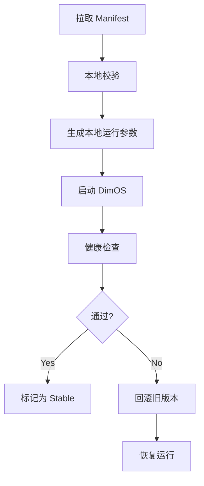
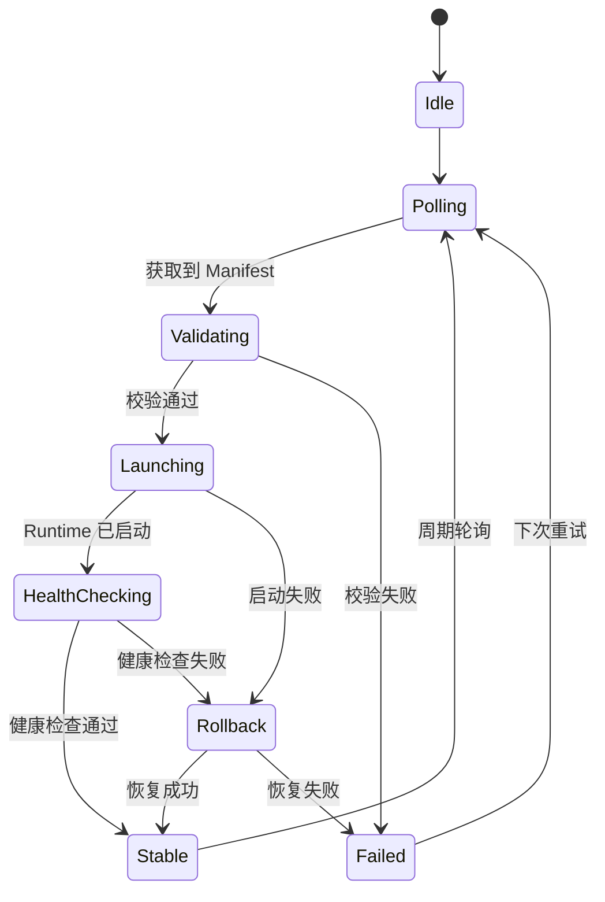

# DimOS 阶段 3：本地 Loader 最小闭环详细方案

## 1. 文档目标

本文档用于细化 `DimOS 云端化实施路线图` 中的“阶段 3：本地 Loader 最小闭环”。

目标是明确：

- Robot Loader Agent 在本地需要承担哪些职责
- 最小闭环应该包含哪些状态与动作
- 如何与云端配置中心、DimOS Runtime 协作
- 健康检查和回滚应如何设计
- 阶段 3 的最小可落地范围和验收标准是什么

本文档只讨论方案设计，不涉及实现代码。

## 2. 阶段定位

阶段 2 解决的是“云端能提供配置”。

阶段 3 解决的是：

> 机器人本地如何把这份配置真正执行起来，并在失败时自动恢复。

因此，阶段 3 是整个云端化体系里第一个真正的“本地自治闭环”。

它的核心目标不是做完整发布平台，而是先把以下四件事打通：

- 拉取配置
- 启动 DimOS
- 做最小健康检查
- 启动失败时回滚

## 3. 本地 Loader 的角色

Robot Loader Agent 是机器人本地的部署控制器，不是机器人业务模块，也不是实时控制器。

它的职责是：

- 从云端获取当前设备对应的 Manifest
- 在本地校验 Manifest
- 准备本地运行参数
- 启动或重启 DimOS Runtime
- 检查运行是否成功
- 在失败时恢复上一个稳定版本
- 持久化本地状态
- 向云端上报结果

一句话说：

> Loader 负责“让系统可靠地启动和恢复”，DimOS 负责“让机器人真正工作”。

## 4. 阶段 3 的最小闭环

阶段 3 的最小业务闭环应为：



这里的关键点是：

- 成功与否必须由本地判断
- 回滚必须在本地执行
- 回滚依赖本地稳定版本，而不是依赖云端重新下载

## 5. 状态机设计

建议 Loader 在阶段 3 就采用明确状态机，而不是简单脚本串联。

### 5.1 推荐状态



### 5.2 状态说明

- `Idle`
  - 当前无操作
- `Polling`
  - 检查是否有新的 Manifest
- `Validating`
  - 校验 Manifest 结构、目标设备、基本环境兼容性
- `Launching`
  - 准备参数并启动 DimOS
- `HealthChecking`
  - 检查 Runtime 是否正常运行
- `Stable`
  - 当前版本被标记为稳定版本
- `Rollback`
  - 恢复上一个稳定版本
- `Failed`
  - 当前操作失败，需要等待人工处理或下一次重试

## 6. 核心组件拆分

为了后续可维护，建议阶段 3 起就按职责拆组件。

### 6.1 ManifestClient

负责：

- 从云端配置中心查询当前设备对应的 Manifest
- 拉取最新版本

阶段 3 仅需要：

- 支持轮询查询
- 支持根据 `device_id` 获取配置

### 6.2 ManifestValidator

负责：

- 校验 Manifest 结构是否合法
- 校验目标设备是否匹配
- 校验本地运行环境是否基本兼容

阶段 3 的校验重点是：

- `manifest_version`
- `target`
- `entrypoint.blueprint`
- `global_config`
- 最小健康检查字段

### 6.3 RuntimeController

负责：

- 生成本地运行参数
- 启动 DimOS
- 停止 DimOS
- 查询本地 Runtime 状态

建议不要重写 DimOS 核心逻辑，而是包装现有 `dimos run` 能力和本地运行注册信息。

### 6.4 HealthChecker

负责：

- 判断这次启动是否算成功
- 输出结构化健康报告

阶段 3 只做最小健康检查，不做复杂业务级检查。

### 6.5 RollbackManager

负责：

- 选择回滚目标版本
- 停止当前失败版本
- 恢复稳定版本
- 记录回滚事件

### 6.6 StateStore

负责：

- 保存 Loader 当前状态
- 保存当前版本、稳定版本、失败版本信息
- 保存最近错误

## 7. 本地状态对象设计

建议阶段 3 至少维护如下状态：

```json
{
  "device_id": "go2-001",
  "state": "Stable",
  "current_manifest_id": "manifest-2026-04-01-001",
  "current_release": "go2-prod-2026.04.01.001",
  "stable_release": "go2-prod-2026.03.20.002",
  "last_failed_release": null,
  "last_error": null,
  "last_poll_at": "2026-04-01T10:10:00Z",
  "last_healthcheck": "passed"
}
```

## 8. 本地目录结构建议

```text
/var/lib/dimos-loader/
  manifests/
  releases/
    current/
    stable/
    failed/
  state/
    loader_state.json
    rollback_history.json
  logs/
```

说明：

- 阶段 3 还不一定需要完整发布包缓存目录
- 重点是有状态持久化和稳定版本记录

## 9. 启动流程设计

### 9.1 输入

输入来自当前设备的 Manifest。

### 9.2 启动步骤

1. 拉取 Manifest
2. 执行本地校验
3. 解析出 `blueprint + global_config`
4. 调用 RuntimeController 启动 DimOS
5. 执行健康检查
6. 成功则写入 Stable
7. 失败则触发 Rollback

### 9.3 启动结果分类

建议分三类：

- `launch_success`
- `launch_failed`
- `launch_rolled_back`

## 10. 最小健康检查设计

阶段 3 推荐的健康检查应尽量简单、稳定、可重复。

建议分三层：

### 10.1 进程层

检查：

- DimOS 主进程是否存在
- run registry 是否已写入

### 10.2 运行时层

检查：

- worker 是否启动
- blueprint 是否成功 build

### 10.3 最小功能层

检查：

- 指定关键模块是否存在
- 指定关键 RPC 是否可达

阶段 3 不建议一开始就检查复杂业务结果，例如导航目标是否可达、Agent 是否完成推理等。

## 11. 回滚设计

### 11.1 回滚触发条件

建议至少包括：

- Manifest 校验通过，但 Runtime 启动失败
- Runtime 启动后健康检查失败
- 启动后在短时间内异常退出

### 11.2 回滚目标选择

优先级建议：

1. 明确指定的 `previous_stable_release`
2. 本地记录的最近稳定版本
3. 如果都没有，则进入 `Failed`，等待人工介入

### 11.3 回滚执行步骤

1. 停止当前失败版本
2. 加载本地稳定版本配置
3. 重新启动 DimOS
4. 重新做最小健康检查
5. 记录回滚结果

## 12. 与云端配置中心的交互

阶段 3 与云端配置中心的交互应尽量简单。

建议仅保留：

- 查询当前设备配置
- 上报启动结果
- 上报回滚事件

也就是说，阶段 3 的本地闭环应尽量独立，不依赖复杂远程控制。

## 13. 最小 API 需求

为了支撑阶段 3，本地 Loader 至少应提供以下本地接口：

- `check_for_update()`
- `activate_manifest(manifest_id)`
- `get_loader_state()`
- `get_runtime_state()`
- `rollback()`

这些接口不一定一开始就对外开放成网络服务，但逻辑上应明确存在。

## 14. 推荐错误分类

建议阶段 3 起就统一错误分类：

- `ManifestValidationError`
- `RuntimeLaunchError`
- `HealthcheckError`
- `RollbackError`

这能帮助：

- 本地状态更清晰
- 云端审计更清晰
- 后续 API 语义更稳定

## 15. 阶段 3 的完成标准

阶段 3 完成时，至少应满足：

- Loader 能拉取当前设备的 Manifest
- Manifest 能稳定映射到本地运行参数
- DimOS 能通过 Loader 启动
- 启动失败可自动回滚
- 回滚后系统可恢复到稳定状态
- 本地状态和最近错误可查询

## 16. 风险与注意事项

### 16.1 不要把阶段 3 做成完整平台

阶段 3 的重点是最小闭环，不是一次性做完整发布系统。

### 16.2 不要让回滚依赖云端

回滚必须依赖本地状态和本地稳定版本，否则一旦断网，系统无法恢复。

### 16.3 健康检查不要过重

阶段 3 应优先做“简单但可靠”的健康检查，而不是引入复杂业务校验导致误判。

### 16.4 Loader 状态必须可持久化

如果 Loader 重启后丢失当前状态、稳定版本和失败记录，闭环就不可靠。

## 17. 与后续阶段的关系

阶段 3 为后续能力提供基础：

- 阶段 4 在它之上增加发布包分发与缓存
- 阶段 5 在它之上增加云端发布 / 回滚控制面
- 阶段 6 在它之上增加灰度与审计能力

所以阶段 3 是整个云端化方案中最关键的“本地执行基座”。

## 18. 结论

阶段 3 的本质，是先让机器人本地具备最基本的自治部署能力：

- 能拉配置
- 能启动
- 能检查
- 能回滚

只要这一闭环建立起来，DimOS 就具备了从“可本地运行”迈向“可被可靠管理”的关键基础。
