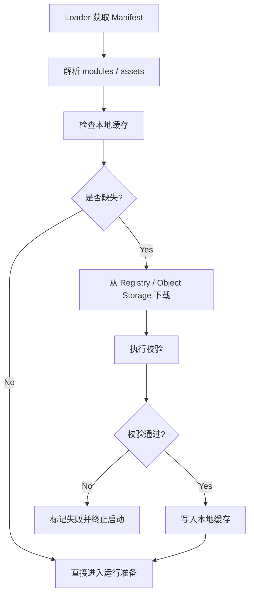

# DimOS 阶段 4：模块发布包分发详细方案

## 1. 文档目标

本文档用于细化 `DimOS 云端化实施路线图` 中的“阶段 4：模块发布包分发”。

目标是明确：

- 模块发布包分发阶段到底解决什么问题
- 发布包应如何分类、拉取、缓存、校验和装配
- 它与 Manifest、Loader、Runtime 的关系是什么
- 阶段 4 的最小可落地范围和验收标准是什么

本文档只讨论方案设计，不涉及实现代码。

## 2. 阶段定位

阶段 2 解决了“云端可以提供配置”。  
阶段 3 解决了“本地可以基于配置启动并回滚”。

阶段 4 进一步解决：

> 机器人运行所需的模块内容，不再默认完全固化在本地，而可以通过标准化发布包进行分发、缓存和校验。

也就是说，阶段 4 才真正开始补齐“运行内容的远程获取能力”。

## 3. 阶段目标

阶段 4 的目标不是一口气做成完整的软件仓库平台，而是先建立一个稳定的发布包闭环：

- Manifest 能声明依赖哪些模块发布包
- Loader 能拉取这些发布包
- 本地能缓存这些发布包
- 本地能校验这些发布包
- Runtime 能使用这些发布包启动系统

一句话说：

> 阶段 4 的核心是把“运行内容”标准化为可分发、可缓存、可校验的发布包。

## 4. 职责边界

### 4.1 阶段 4 负责什么

- 定义模块发布包类型
- 定义发布包来源
- 定义下载和缓存策略
- 定义校验规则
- 建立发布包与 Manifest 的关联机制

### 4.2 阶段 4 不负责什么

- 复杂灰度发布策略
- 大规模批量发布编排
- 多区域镜像复制策略
- 完整发布包生命周期治理平台
- 复杂租户隔离和商业化仓库策略

这些内容属于后续控制面和运维层增强。

## 5. 模块发布包分类

建议阶段 4 支持三类发布包：

### 5.1 OCI 镜像

适合：

- 依赖复杂模块
- GPU 推理模块
- 服务型模块
- 感知和模型推理模块

特点：

- 封装完整
- 运行环境稳定
- 易于回滚到指定版本

### 5.2 Python wheel 包

适合：

- 轻量 Python 模块
- 依赖相对简单的扩展模块

特点：

- 更轻
- 分发成本低
- 更适合纯 Python 逻辑扩展

### 5.3 模型 / 数据 Blob

适合：

- ONNX 模型
- 权重文件
- 地图文件
- URDF / MJCF
- 静态资源

特点：

- 与代码解耦
- 可单独升级
- 适合缓存和挂载

## 6. 推荐优先级

阶段 4 不建议三类一起全量推进。

推荐优先顺序：

1. OCI 镜像
2. 模型 / 数据 Blob
3. Python wheel 包

原因：

- OCI 镜像与当前 DimOS 已有 Docker 化能力最接近
- Blob 管理对模型与资源分离很关键
- wheel 包虽然轻，但环境一致性更难控制，应放在后面

## 7. 发布包来源设计

Loader 应该只从受信任来源拉取发布包。

建议来源分三类：

### 7.1 OCI Registry

适合：

- Docker 镜像

示例：

- `registry.company/dimos/object-tracking:1.3.4`

### 7.2 对象存储

适合：

- Blob
- wheel 包
- Manifest 原文归档

示例：

- `s3://dimos-artifacts/models/go2_nav/model.onnx`
- `s3://dimos-artifacts/wheels/agent_core-0.9.2.whl`

### 7.3 独立 Package Registry

适合：

- Python 包分发体系成熟后单独管理 wheel 包

阶段 4 初期不是必须。

## 8. Manifest 与发布包的关系

Manifest 中至少应包含两个与发布包直接相关的区域：

- `modules`
- `assets`

### 8.1 `modules`

用于描述：

- 需要哪些模块发布包
- 发布包类型是什么
- 来源是什么
- 版本是什么
- 校验值是什么
- 是否必需

### 8.2 `assets`

用于描述：

- 模型和资源文件
- 来源与版本
- 本地挂载位置
- 校验值

## 9. Loader 在阶段 4 的新增职责

相对于阶段 3，阶段 4 Loader 需要新增：

- 根据 Manifest 识别缺失发布包
- 拉取发布包到本地缓存
- 校验 digest / checksum
- 建立本地缓存索引
- 向 Runtime 暴露本地已准备好的发布包路径或引用

也就是说，阶段 4 的 Loader 不再只是“拉配置并启动”，而是开始承担“运行内容准备器”的角色。

## 10. 本地缓存设计

阶段 4 必须引入正式缓存目录。

推荐结构：

```text
/var/lib/dimos-loader/
  manifests/
  cache/
    oci/
    wheels/
    blobs/
  releases/
    current/
    stable/
    staged/
  state/
    loader_state.json
    package_index.json
    rollback_history.json
  logs/
```

### 10.1 缓存目的

缓存的作用不是单纯节省带宽，而是保障：

- 离线可启动
- 离线可回滚
- 重启后无需重复下载
- 回滚时不依赖云端

### 10.2 缓存策略建议

建议至少支持：

- 命中复用
- 版本并存
- 稳定版本保护
- 失败版本隔离
- 定期清理非稳定旧包

## 11. 发布包校验设计

阶段 4 必须把“校验”作为第一优先级，而不是可选项。

建议至少校验：

### 11.1 来源校验

- 来源域名或仓库是否在白名单中

### 11.2 完整性校验

- Docker 镜像 digest
- wheel 包 sha256
- Blob sha256

### 11.3 版本一致性校验

- 下载到的内容是否和 Manifest 声明版本一致

### 11.4 设备兼容性校验

- 架构是否匹配
- OS 是否匹配
- 是否需要 GPU

## 12. 发布包拉取流程



## 13. Runtime 如何使用发布包

阶段 4 需要明确：发布包是给 Runtime 用的，但不是由 Runtime 自己去做远程下载。

推荐边界：

- Loader 负责下载、校验、缓存
- Runtime 只消费“本地已准备好”的内容

例如：

- Docker 模块由 Loader 确保镜像可用
- wheel 包由 Loader 确保本地可安装或可引用
- Blob 由 Loader 确保路径已准备好

这样 Runtime 的职责仍然保持清晰：

- 运行，不负责远程供应链管理

## 14. 失败处理设计

阶段 4 需要明确下载和校验失败时的处理策略。

### 14.1 对必需发布包

如果 `required=true` 的模块发布包失败：

- 当前启动流程必须中止
- 不能带病进入 Runtime
- 必须进入失败或回滚流程

### 14.2 对非必需发布包

如果 `required=false` 的模块发布包失败：

- 可记录告警
- 可允许系统在降级模式下继续运行

### 14.3 对资源包失败

如果关键模型或关键地图资源缺失：

- 应视为启动失败

## 15. 本阶段最小 API 需求

阶段 4 不一定要求完整云端控制 API，但 Loader 本地至少应具备：

- `list_required_packages(manifest)`
- `pull_packages(release_id)`
- `verify_package(package_ref)`
- `list_cached_packages()`
- `purge_non_stable_cache()`

注意这里的接口名可以后续调整，但逻辑能力必须存在。

## 16. 阶段 4 的最小验收标准

阶段 4 完成时，至少应满足：

- Manifest 能声明模块发布包和资源包
- Loader 能识别缺失发布包
- Loader 能从受信任来源拉取发布包
- 下载完成后能做完整性校验
- 校验通过后能写入本地缓存
- Runtime 能基于本地缓存成功启动
- 下载失败或校验失败时不会错误启动系统

## 17. 风险与注意事项

### 17.1 不要过早支持过多包类型

优先把 OCI 和 Blob 做稳定，再考虑 wheel 包体系。

### 17.2 不要让 Runtime 负责下载

如果 Runtime 自己去拉包，会把运行职责和供应链职责混在一起。

### 17.3 不要把缓存当作临时目录

缓存是回滚和离线能力的核心基础设施，不应视为临时文件区。

### 17.4 校验不可省略

如果没有 digest / checksum 校验，整个云端发布链就不可信。

## 18. 与后续阶段的关系

阶段 4 完成后：

- 阶段 5 才能真正做统一发布 / 回滚控制面
- 阶段 6 才能做灰度发布和大规模运维

因为没有稳定的发布包分发能力，后续控制面只能控制“配置”，无法控制“运行内容”。

## 19. 结论

阶段 4 的本质，是把 DimOS 的运行内容从“默认固化在本地”转变为“可被标准化管理和分发的模块发布包”。

它是从“配置中心 + 本地启动闭环”迈向“可发布、可缓存、可复用、可回滚”的关键一步。

