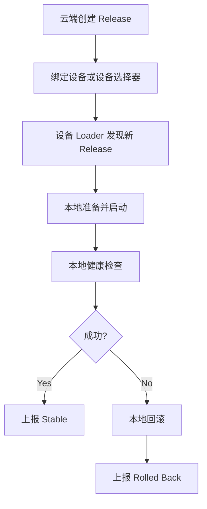

# DimOS 阶段 5：发布 / 回滚控制面详细方案

## 1. 文档目标

本文档用于细化 `DimOS 云端化实施路线图` 中的“阶段 5：发布 / 回滚控制面”。

目标是明确：

- 发布 / 回滚控制面解决什么问题
- 云端控制面和本地 Loader 的职责边界是什么
- Release 模型应该如何设计
- 发布 API、回滚 API、状态查询 API 应如何组织
- 阶段 5 的最小落地闭环和验收标准是什么

本文档只讨论方案设计，不涉及实现代码。

## 2. 阶段定位

阶段 2 让云端可以提供配置。  
阶段 3 让本地 Loader 可以启动和回滚。  
阶段 4 让发布包可以被拉取和缓存。

阶段 5 进一步解决：

> 云端如何统一地管理“发布到哪些设备、当前状态是什么、失败是否回滚、历史是否可追踪”。

也就是说，阶段 5 是从“单设备本地闭环”迈向“受控发布体系”的关键阶段。

## 3. 核心目标

阶段 5 的核心目标不是做完整运维平台，而是建立最小可控发布闭环：

- 云端能创建 Release
- 云端能将 Release 分配到设备
- 设备本地 Loader 能执行 Release
- 云端能查看执行结果
- 云端能触发回滚
- 回滚结果能被追踪

## 4. 职责边界

### 4.1 云端控制面负责什么

- 创建 Release
- 管理 Release 元数据
- 管理 Release 与设备的绑定关系
- 接收本地 Loader 上报的执行状态
- 提供状态查询接口
- 提供回滚指令入口
- 记录发布和回滚事件

### 4.2 云端控制面不负责什么

- 直接远程控制机器人实时动作
- 代替 Loader 执行本地启动
- 代替本地执行回滚
- 直接下载并准备本地发布包

### 4.3 本地 Loader 负责什么

- 拉取目标 Release 对应的 Manifest
- 本地准备运行参数与发布包
- 本地启动 DimOS
- 本地健康检查
- 本地执行回滚
- 上报当前结果

一句话说：

> 云端控制面负责“决定要发布什么”，本地 Loader 负责“把发布真正执行出来”。

## 5. Release 模型设计

Release 是阶段 5 的核心对象。

它不是简单的 Manifest 副本，而是一次“可被下发、执行、追踪、回滚”的发布单元。

### 5.1 推荐字段

- `release_id`
- `manifest_id`
- `version`
- `target_selector`
- `status`
- `created_at`
- `created_by`
- `description`
- `rollout_mode`
- `rollback_policy`

### 5.2 推荐状态

建议状态至少包括：

- `draft`
- `ready`
- `deploying`
- `stable`
- `failed`
- `rolled_back`

### 5.3 说明

- `draft`
  - 还未进入发布流程
- `ready`
  - 已可下发到设备
- `deploying`
  - 设备正在执行
- `stable`
  - 发布结果稳定
- `failed`
  - 发布失败
- `rolled_back`
  - 已触发并完成回滚

## 6. 设备部署记录模型

除了 Release，本阶段还需要单设备部署记录对象，用于跟踪每台设备的实际执行情况。

建议对象名：`DeploymentRecord`

### 6.1 建议字段

- `deployment_id`
- `release_id`
- `device_id`
- `status`
- `current_manifest_id`
- `current_release`
- `stable_release`
- `last_error`
- `started_at`
- `finished_at`

### 6.2 推荐状态

- `pending`
- `pulling`
- `launching`
- `health_checking`
- `stable`
- `failed`
- `rolling_back`
- `rolled_back`

## 7. 最小发布闭环



## 8. 推荐 API 设计

建议按四组 API 组织：

- Release API
- Deployment API
- Rollback API
- Device Status API

## 8.1 Release API

### `POST /api/releases`

用途：

- 创建新的 Release

请求示例：

```json
{
  "release_id": "go2-prod-2026.04.01.001",
  "manifest_id": "manifest-2026-04-01-001",
  "target_selector": {
    "robot_type": "unitree_go2",
    "labels": ["prod"]
  },
  "rollout_mode": "manual",
  "rollback_policy": {
    "auto": true
  },
  "description": "go2 production release"
}
```

### `GET /api/releases/{release_id}`

用途：

- 获取某个 Release 的完整信息

### `POST /api/releases/{release_id}/activate`

用途：

- 将 Release 切换为可部署状态

## 8.2 Deployment API

### `POST /api/releases/{release_id}/deploy`

用途：

- 将 Release 发布到指定设备或设备组

请求示例：

```json
{
  "devices": ["go2-001", "go2-002"],
  "mode": "rolling"
}
```

### `GET /api/releases/{release_id}/deployments`

用途：

- 查看某个 Release 下所有设备的部署状态

## 8.3 Rollback API

### `POST /api/devices/{device_id}/rollback`

用途：

- 对单设备触发回滚

### `POST /api/releases/{release_id}/rollback`

用途：

- 将一个 Release 对应的设备批量回滚

### `GET /api/rollbacks`

用途：

- 查询回滚事件记录

## 8.4 Device Status API

### `GET /api/devices/{device_id}/deployment`

用途：

- 查看设备当前部署状态

### `GET /api/devices/{device_id}/runtime`

用途：

- 查看设备当前 Runtime 状态

## 9. 推荐返回模型

建议控制面 API 统一返回标准状态模型：

```json
{
  "request_id": "req-123",
  "device_id": "go2-001",
  "release_id": "go2-prod-2026.04.01.001",
  "status": "accepted",
  "message": "Deployment request accepted"
}
```

推荐状态值：

- `accepted`
- `in_progress`
- `stable`
- `failed`
- `rolled_back`

## 10. 本地 Loader 与控制面的交互方式

建议控制面不主动 SSH 或远程执行机器人侧逻辑，而采用：

- 云端发布状态可见
- Loader 定期轮询
- Loader 本地主动执行
- Loader 向云端回报结果

这是更符合机器人边缘侧场景的方式。

## 11. 状态上报设计

本地 Loader 应定期向控制面上报：

### 11.1 心跳

包含：

- `device_id`
- 当前状态
- 当前 release
- 当前稳定版本
- 健康状态
- 时间戳

### 11.2 发布结果

包含：

- `release_id`
- 成功 / 失败
- 错误原因
- 启动时间
- 健康检查结果

### 11.3 回滚事件

包含：

- 回滚前版本
- 回滚后版本
- 回滚原因
- 回滚时间

## 12. 审计模型建议

阶段 5 起，建议所有关键动作都进入审计链：

- 谁创建了 Release
- 谁激活了 Release
- 哪些设备执行了发布
- 哪些设备失败了
- 哪些设备回滚了
- 回滚原因是什么

推荐审计对象：

- `ReleaseAuditEvent`
- `DeploymentAuditEvent`
- `RollbackAuditEvent`

## 13. 失败处理与控制面行为

### 13.1 单设备失败

如果单台设备失败：

- 本地 Loader 负责回滚
- 云端控制面只记录结果
- 控制面可以提示人工关注

### 13.2 多设备失败

如果同一 Release 出现大量失败：

- 控制面应允许人工暂停发布
- 后续在阶段 6 再扩展成自动熔断机制

### 13.3 控制面原则

控制面不直接替本地做恢复动作，只做：

- 记录
- 可视化
- 编排
- 触发新的回滚指令

## 14. 阶段 5 的最小验收标准

阶段 5 完成时，至少应满足：

- 云端可创建并管理 Release
- 云端可对单设备触发发布
- 本地 Loader 能识别并执行对应 Release
- 云端可查看设备部署状态
- 云端可对单设备触发回滚
- 发布和回滚结果可追踪

## 15. 风险与注意事项

### 15.1 不要把云端控制面做成远程执行器

如果控制面直接远程操控机器人本地过程，会导致边界混乱、可靠性变差。

### 15.2 不要让状态语义混乱

Release 状态、Deployment 状态、Runtime 状态必须分开。

### 15.3 回滚结果要和发布结果分开建模

“发布失败”和“已成功回滚”不是同一个状态，必须清晰区分。

### 15.4 阶段 5 不要过早引入复杂灰度逻辑

先把单设备和小范围发布闭环打通，再做批量和灰度。

## 16. 与后续阶段的关系

阶段 5 完成后：

- 阶段 6 才能基于这些状态做灰度发布、熔断、审计分析和大规模运维

因此，阶段 5 是“控制面成型”的关键阶段。

## 17. 结论

阶段 5 的本质，是给 DimOS 增加一层统一的云端发布 / 回滚控制面，使系统从“单机本地自治闭环”演进为“可统一编排、可统一观察、可统一审计的设备发布体系”。

它并不替代本地 Loader，而是与本地 Loader 分工协作：

- 云端控制面负责发布意图与状态管理
- 本地 Loader 负责实际执行与恢复

这正是 DimOS 云端化落地所需要的合理控制边界。
