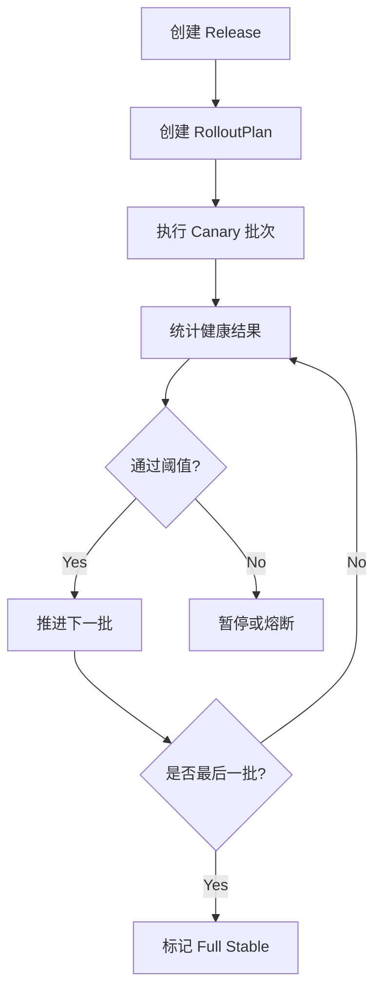

# DimOS 阶段 6：灰度发布与运维审计详细方案

## 1. 文档目标

本文档用于细化 `DimOS 云端化实施路线图` 中的“阶段 6：灰度发布与运维审计”。

目标是明确：

- 灰度发布阶段要解决什么问题
- 怎样在已有 Release / Loader / 回滚能力上叠加批量发布控制
- 审计和运维可观测性应覆盖哪些对象与事件
- 阶段 6 的最小落地范围和验收标准是什么

本文档只讨论方案设计，不涉及实现代码。

## 2. 阶段定位

阶段 5 解决了“云端可以统一发布和回滚”。

阶段 6 进一步解决：

> 当设备数量增多后，如何安全地分批发布、及时止损、统一观察、统一审计，并形成规模化运维闭环。

也就是说，阶段 6 的目标不是新增基础运行能力，而是让已有发布体系具备“规模化、安全化、可观测化”的运维能力。

## 3. 核心目标

阶段 6 的核心目标包括：

- 支持按标签、分组、批次进行灰度发布
- 支持滚动发布和分阶段推进
- 支持失败阈值触发暂停或熔断
- 支持统一审计和回滚分析
- 支持从设备、版本、时间维度追踪全链路事件

## 4. 灰度发布的必要性

当系统开始面向多台机器人时，如果仍然采用“一次全量发布”的方式，会带来明显风险：

- 一个错误 Manifest 可影响所有设备
- 一个错误模块发布包可导致批量异常
- 回滚范围过大，影响生产稳定性
- 失败定位困难

因此，灰度发布的目标是：

- 小范围试运行
- 可控范围扩展
- 出问题时尽快停止
- 让风险隔离在有限设备集内

## 5. 灰度发布模型设计

建议引入 `RolloutPlan` 对象，用于描述一次 Release 的分批发布策略。

### 5.1 推荐字段

- `rollout_plan_id`
- `release_id`
- `selector`
- `strategy`
- `batches`
- `failure_policy`
- `pause_policy`
- `created_at`
- `created_by`

### 5.2 推荐策略类型

- `all_at_once`
- `rolling`
- `batch_percent`
- `batch_fixed`
- `manual_gate`

### 5.3 说明

- `all_at_once`
  - 全量直接发布，只适合小规模或测试环境
- `rolling`
  - 一批完成后推进下一批
- `batch_percent`
  - 按百分比分批，例如 5% -> 20% -> 100%
- `batch_fixed`
  - 按固定台数分批，例如 2 台 -> 10 台 -> 剩余全部
- `manual_gate`
  - 每一批都需人工确认后继续

## 6. 推荐的灰度阶段

建议把一轮灰度分成 4 个逻辑层级：

1. `canary`
2. `pilot`
3. `staged`
4. `full`

### 6.1 Canary

- 少量设备
- 优先用于发现明显问题

### 6.2 Pilot

- 小规模设备组
- 验证核心功能稳定性

### 6.3 Staged

- 中等规模设备组
- 验证批量部署和运行一致性

### 6.4 Full

- 面向全量目标设备

## 7. 设备选择策略

灰度发布必须建立在清晰的设备选择模型之上。

建议至少支持：

- 按 `device_id` 指定
- 按 `robot_type` 过滤
- 按 `labels` 过滤
- 按地理区域过滤
- 按环境过滤，如 `test / preprod / prod`

推荐优先做：

- `robot_type + labels`

这可以覆盖大多数分组发布需求。

## 8. 灰度发布流程

## 9. 失败阈值与熔断策略

阶段 6 需要正式引入“自动暂停”和“熔断”机制。

### 9.1 推荐阈值维度

- 启动失败率
- 健康检查失败率
- 回滚比例
- 指定关键模块失败率
- 指定时间窗口内异常退出比例

### 9.2 推荐动作

当失败超过阈值时，可采取：

- `pause`
  - 暂停后续批次
- `abort`
  - 终止整轮发布
- `rollback_current_batch`
  - 当前批次全部回滚
- `rollback_release`
  - 全部已部署设备回滚

### 9.3 建议初始策略

先从简单规则开始：

- Canary 阶段任何关键失败，直接暂停
- Pilot 阶段失败率超过阈值，停止进入下一批
- Full 阶段失败率超阈值，仅停止后续扩展，不立即全量回滚

## 10. 运维审计范围

阶段 6 的审计不应只记录“发布成功或失败”，而要覆盖完整链路。

建议记录以下事件：

- Manifest 创建
- Release 创建
- Release 激活
- RolloutPlan 创建
- 批次开始
- 批次结束
- 设备启动成功
- 设备启动失败
- 设备回滚
- 批次暂停
- 批次恢复
- 发布终止
- 发布完成

## 11. 审计对象设计

建议引入统一审计事件模型：

### 11.1 AuditEvent

建议字段：

- `event_id`
- `event_type`
- `timestamp`
- `actor`
- `device_id`
- `release_id`
- `rollout_plan_id`
- `payload`

### 11.2 事件类型建议

- `manifest.created`
- `release.created`
- `release.activated`
- `deployment.started`
- `deployment.succeeded`
- `deployment.failed`
- `rollback.started`
- `rollback.succeeded`
- `rollout.paused`
- `rollout.aborted`
- `rollout.completed`

## 12. 运维看板建议

阶段 6 应该开始具备基础运维可视化能力。

建议看板至少展示：

- 当前活跃 Release
- 当前 RolloutPlan 进度
- 各批次成功 / 失败 / 回滚数
- 各设备当前版本
- 最近失败设备列表
- 最近回滚事件列表
- 当前暂停中的发布

## 13. 关键查询能力

为了支撑运维排查，建议支持以下查询维度：

- 按 `release_id` 查看全部设备状态
- 按 `device_id` 查看最近发布历史
- 按时间范围查看失败事件
- 按标签查看某组设备版本分布
- 按回滚原因统计失败分布

## 14. 推荐 API 增强

在阶段 5 基础上，阶段 6 建议新增：

### 14.1 创建 RolloutPlan

`POST /api/releases/{release_id}/rollout-plans`

### 14.2 查询 RolloutPlan 状态

`GET /api/rollout-plans/{rollout_plan_id}`

### 14.3 暂停发布

`POST /api/rollout-plans/{rollout_plan_id}/pause`

### 14.4 恢复发布

`POST /api/rollout-plans/{rollout_plan_id}/resume`

### 14.5 终止发布

`POST /api/rollout-plans/{rollout_plan_id}/abort`

### 14.6 查询审计事件

`GET /api/audit-events`

## 15. 最小可落地范围

阶段 6 不必一开始做完整运维平台，建议最小范围为：

- 支持按标签分批发布
- 支持批次间手动确认
- 支持失败阈值触发暂停
- 支持查看每一批次的结果
- 支持审计事件查询

这已经足够支撑第一版灰度与运维闭环。

## 16. 阶段 6 的最小验收标准

阶段 6 完成时，至少应满足：

- 一个 Release 能按批次分发到设备组
- 可以查看每一批次进度与结果
- 失败超阈值时能自动暂停或终止
- 可按设备 / release / 时间检索审计事件
- 可看到设备版本分布与回滚记录

## 17. 风险与注意事项

### 17.1 不要在基础能力不稳时过早做复杂灰度

如果阶段 3 和阶段 4 还不稳定，灰度控制只会放大噪音。

### 17.2 失败阈值不能拍脑袋设定

不同机器人、不同模块的可接受失败率不同，应先从保守策略开始。

### 17.3 审计事件必须统一结构

如果事件结构不统一，后续运维分析和看板建设会很快失控。

### 17.4 灰度策略应逐步增强

先支持简单 `manual_gate` 和 `batch_fixed`，再逐步扩展到更复杂策略。

## 18. 与整个云端化体系的关系

阶段 6 不是新的基础能力，而是对前面阶段的放大器：

- 没有 Manifest 契约，无法安全灰度
- 没有本地 Loader 闭环，无法可靠批量部署
- 没有发布包管理，无法保证运行内容一致性
- 没有发布 / 回滚控制面，无法统一编排

因此，阶段 6 的价值在于把前面各阶段的能力组织成可规模化运维体系。

## 19. 结论

阶段 6 的本质，是让 DimOS 的云端发布体系从“可发布”进一步演进为“可规模化、安全化、可审计地发布”。

它的核心价值不在于新增一个单独功能，而在于让已有发布能力具备：

- 分批推进能力
- 风险控制能力
- 运维观察能力
- 审计追踪能力

这是 DimOS 真正走向工程化和规模化运维的最后一层关键能力。
