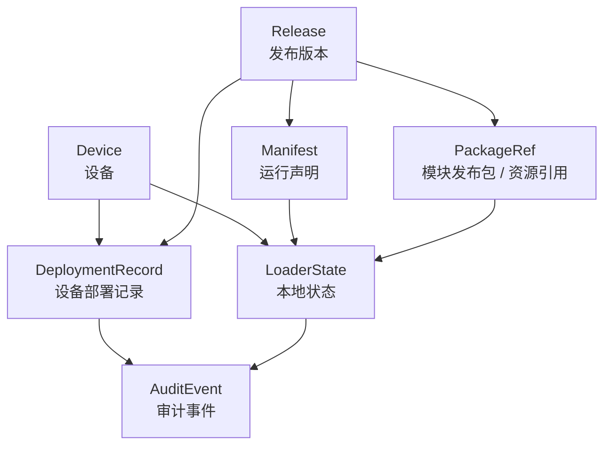
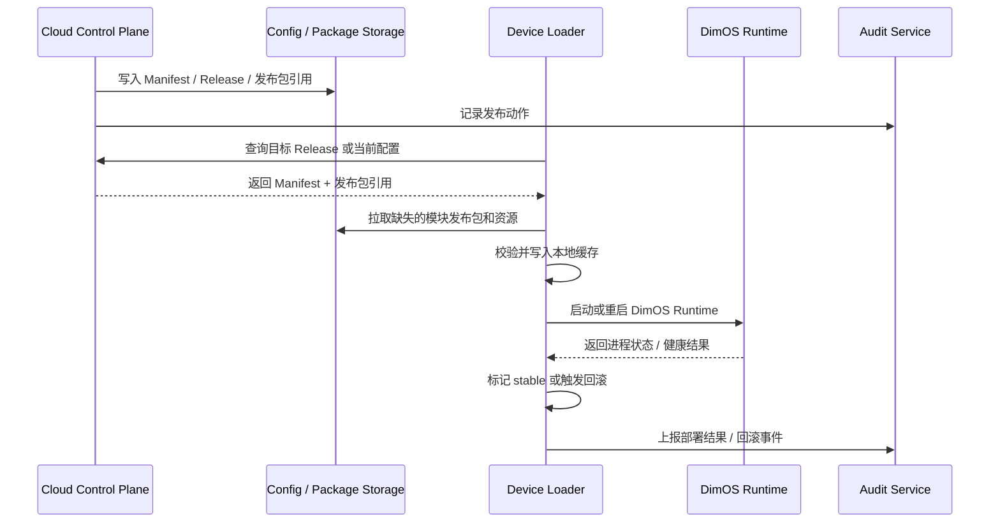
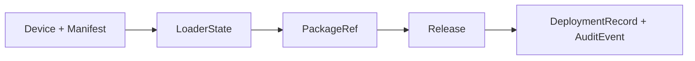

# DimOS 云端化核心对象关系与总流程图

## 1. 文档目标

本文档用于把前面已经拆开的阶段性设计，再收束成一张“核心对象关系图”和一条“端到端主流程”。

它回答三个问题：

- 云端化方案里到底有哪些核心对象
- 这些对象之间是什么关系
- 一次完整的发布和本地生效，主链路如何流转

本文档仍然只讨论方案设计，不涉及实现代码。

## 2. 为什么需要这一层总览

前面的文档已经分别讨论了：

- 配置中心
- 本地 Loader
- 模块发布包分发
- 发布 / 回滚控制面
- 灰度发布与审计

但如果没有一张统一关系图，读者容易出现两个问题：

- 只看到局部功能，看不清整个系统对象之间的边界
- 容易混淆 `Manifest`、`Release`、`Deployment`、`LoaderState` 的职责

所以这一份文档的作用，是把“对象”和“流程”统一起来。

## 3. 核心对象清单

### 3.1 Device

表示一台具体设备，例如某台机器狗、机械臂控制机、无人机边缘计算机。

核心作用：

- 标识设备身份
- 标识设备能力和标签
- 作为配置匹配、发布目标、审计归属的主体

### 3.2 Manifest

表示一份可被本地 Loader 解析的运行声明。

核心作用：

- 描述应该运行什么
- 描述需要哪些模块发布包和资源
- 描述启动参数、健康检查、兼容性约束

可以把它理解为：

> 机器人本次应如何装配和启动的标准说明书。

### 3.3 Release

表示一次“可发布版本”。

核心作用：

- 把一个确定版本的 Manifest 固化为可管理对象
- 绑定一组经过确认的模块发布包引用
- 成为发布、回滚、审计的中心版本单位

更准确地说：

- `Manifest` 偏运行声明
- `Release` 偏发布管理对象

在早期阶段，可以先直接以 Manifest 驱动本地运行。到了阶段 5，应该逐步以 Release 作为正式发布单位。

### 3.4 PackageRef

表示一个模块发布包或资源引用。

包括：

- OCI 镜像引用
- wheel 包引用
- 模型 / 地图 / URDF 等 Blob 引用

核心作用：

- 告诉 Loader 需要去哪里拉取什么内容
- 作为缓存、校验、版本一致性的依据

### 3.5 DeploymentRecord

表示某个 Release 在某台 Device 上的一次部署结果。

核心作用：

- 记录目标设备
- 记录部署状态
- 记录当前版本、失败原因、回滚结果

它是“版本”和“设备实例”之间的桥。

### 3.6 LoaderState

表示机器人本地 Loader 的持久化状态。

核心作用：

- 记录当前激活版本
- 记录 stable 版本
- 记录缓存索引
- 记录回滚历史
- 保证断电、重启后仍可恢复

这是本地可靠性的核心对象，不应只存在于内存中。

### 3.7 AuditEvent

表示发布链路中的审计事件。

核心作用：

- 记录谁在什么时间做了什么动作
- 记录设备反馈了什么结果
- 支持发布追踪、问题复盘、合规审计

## 4. 核心对象关系图

## 5. 最关键的关系解释

### 5.1 Manifest 和 Release 的关系

这两个对象最容易混淆。

更简洁地说：

- `Manifest` 是运行内容定义
- `Release` 是发布管理单位

也就是：

- Manifest 负责描述“怎么运行”
- Release 负责描述“发布哪个版本给哪些设备”

### 5.2 Release 和 PackageRef 的关系

Release 不应只是一个字符串版本号，它应明确引用一组确定的模块发布包。

否则即使 Manifest 名字相同，不同时间拉到的运行内容也可能不一致，无法保证可回滚和可审计。

### 5.3 Device 和 DeploymentRecord 的关系

同一个 Release 会被发布到很多设备上，但每台设备执行结果不同。

所以必须单独有 `DeploymentRecord`：

- 用于记录设备级结果
- 用于支持部分失败、单机回滚、灰度统计

### 5.4 LoaderState 和云端对象的关系

云端记录的是管理视角。  
本地 `LoaderState` 记录的是执行视角。

两者不能互相替代。

原因是：

- 云端可查询，但不保证设备离线时可用
- 本地状态直接决定是否能启动、回滚、恢复

## 6. 端到端主流程

## 7. 云端与本地的清晰边界

### 7.1 云端负责

- 管理 Device 元数据
- 管理 Manifest
- 管理 Release
- 管理模块发布包引用
- 管理发布策略和审计记录

### 7.2 本地负责

- 拉取目标配置
- 拉取并缓存模块发布包
- 做本地校验
- 启动 DimOS Runtime
- 做健康检查
- 做本地回滚
- 持久化 LoaderState

### 7.3 Runtime 负责

- 运行已经准备好的 Module / Blueprint
- 不负责云端配置管理
- 不负责远程发布包下载
- 不负责发布策略决策

## 8. 最小可落地主线

如果只保留最必要对象，最小闭环只需要：

- `Device`
- `Manifest`
- `LoaderState`

如果要进入正式发布管理，则必须增加：

- `Release`
- `DeploymentRecord`
- `AuditEvent`

如果要进入远程内容供应，则必须增加：

- `PackageRef`

所以整个建设顺序其实可以概括为：

## 9. 阅读建议

如果读者主要关心“整体关系”，建议按这个顺序继续阅读：

1. 本文档
2. `03_dimos_cloud_config_center_design.md`
3. `04_dimos_loader_minimal_loop_design.md`
4. `05_dimos_package_distribution_design.md`
5. `06_dimos_release_and_rollback_control_plane_design.md`
6. `07_dimos_rollout_and_audit_design.md`

## 10. 结论

把 DimOS 云端化方案收束后，可以得到一个非常清晰的主判断：

- `Manifest` 解决的是运行定义
- `Release` 解决的是版本发布
- `PackageRef` 解决的是运行内容供应
- `LoaderState` 解决的是本地可靠执行
- `DeploymentRecord` 和 `AuditEvent` 解决的是可追踪、可运维、可回滚

因此，DimOS 云端化并不是单纯“把配置放到云上”，而是逐步建立一套：

> 云端管理发布关系，本地可靠执行运行闭环的机器人运行平台。
