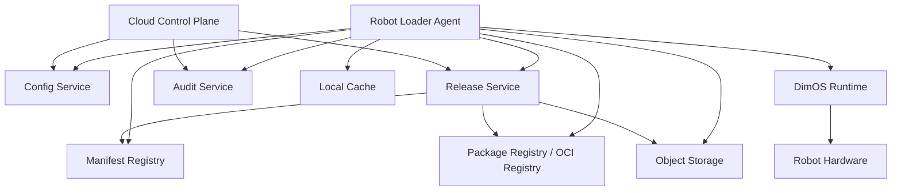
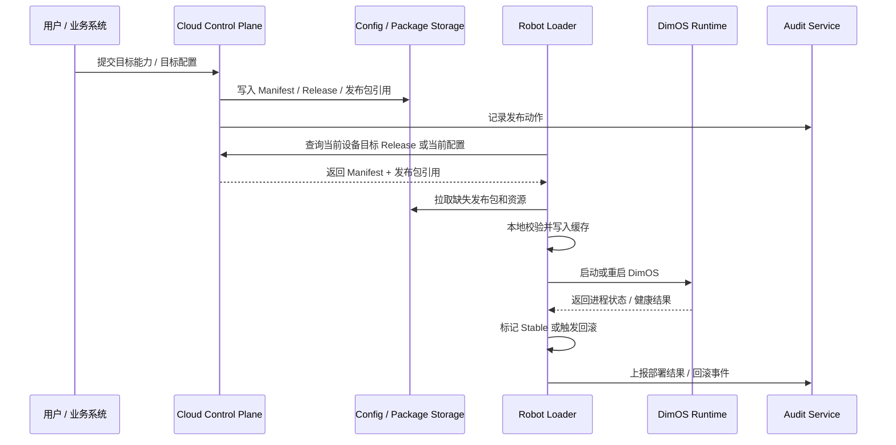
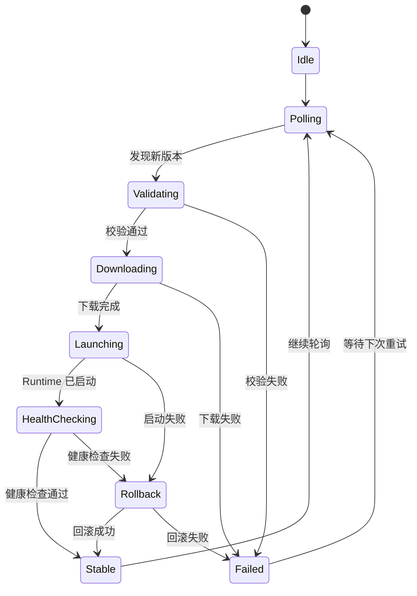

# DimOS 云端设计 PRD（二）：详细方案与实施路径

## 1. 文档目标

本文档用于回答“DimOS 云端设计应该怎么做”。

目标是形成一份可汇报、可评审、可推进的详细方案，讲清楚：

- 设计目标是什么
- 边界是什么
- 核心对象是什么
- 系统架构怎么组织
- 主流程怎么跑
- 应该按什么步骤建设

本文档只讨论方案设计，不涉及具体实现代码。

## 2. 产品目标

DimOS 云端设计的目标，不是把机器人控制搬到云端，而是建立一套“用户或业务系统决定目标状态，云端管理与分发，本地执行与恢复”的运行体系。

需要解决的问题包括：

- 机器人配置分散，难统一管理
- 版本发布缺少标准流程
- 模块发布包无法统一管理和下发
- 新版本失败时缺少可靠回滚
- 多台设备难以统一观察、审计和灰度发布

因此，DimOS 云端设计的目标是：

- 云端统一管理配置
- 云端统一管理发布版本
- 云端统一管理模块发布包引用
- 本地可靠执行启动、健康检查、回滚
- 全过程具备状态追踪和审计能力

## 3. 核心设计原则

### 3.1 本地运行原则

实时控制、模块运行、硬件交互、故障恢复，仍然在机器人本地执行。

### 3.2 云端控制面原则

云端负责：

- 承载和管理已经被选定的目标状态
- 配置管理
- 发布管理
- 版本管理
- 审计与策略管理

云端不负责：

- 自主决定机器人业务功能
- 实时动作控制。

### 3.3 数据契约原则

云端与本地之间必须通过稳定的 `Manifest` 协同，而不是依赖临时参数拼接。

### 3.4 可回滚原则

任何新版本上线，都必须支持本地回滚；回滚必须优先依赖本地缓存，而不是依赖网络。

### 3.5 供应链清晰原则

本地 Runtime 只负责运行，不负责远程下载。

- Loader 负责拉取、校验、缓存
- Runtime 负责消费本地已准备好的内容

## 4. 总体方案概述

DimOS 云端设计推荐采用四层责任结构：

### 4.1 功能决策层

负责：

- 由用户、业务系统、调度系统或本地策略决定机器人需要什么能力
- 形成目标配置、目标版本或目标任务状态

### 4.2 云端控制层

负责：

- 管理设备信息
- 管理 Manifest
- 管理 Release
- 管理模块发布包引用
- 管理发布策略
- 管理审计事件
- 管理和分发已选定的目标状态

### 4.3 本地加载控制层

由 `Robot Loader Agent` 承担，负责：

- 拉取配置与 Release
- 拉取模块发布包
- 本地校验
- 本地缓存
- 启动或重启 DimOS
- 健康检查
- 回滚
- 状态上报

### 4.4 本地运行时层

由 DimOS Runtime 承担，负责：

- 运行 `Blueprint`
- 启动 `Module`
- 连接 `Stream / RPC / Spec`
- 驱动真实机器人系统

## 5. 核心对象设计

云端化方案至少围绕 7 个核心对象展开。

### 5.1 Device

表示一台设备。

作用：

- 标识设备身份
- 标识设备类型、架构、标签
- 作为配置匹配和发布目标

### 5.2 Manifest

表示一份标准化运行声明。

作用：

- 定义应该运行哪个 blueprint
- 定义 global_config
- 定义依赖哪些模块发布包和资源
- 定义健康检查和回滚信息

### 5.3 Release

表示一次正式可发布版本。

作用：

- 把 Manifest 固化为可管理、可追踪的发布单元
- 成为发布、回滚、审计的中心版本对象

### 5.4 PackageRef

表示模块发布包或资源引用。

包括：

- OCI 镜像
- wheel 包
- 模型 / 地图 / URDF 等 Blob

### 5.5 DeploymentRecord

表示某个 Release 在某台设备上的部署结果。

作用：

- 记录设备级执行状态
- 记录失败、稳定、回滚结果

### 5.6 LoaderState

表示机器人本地 Loader 的持久化状态。

作用：

- 记录当前激活版本
- 记录 stable 版本
- 记录缓存索引
- 记录最近失败和回滚信息

### 5.7 AuditEvent

表示系统中的关键审计事件。

作用：

- 记录配置、发布、部署、回滚、暂停、终止等动作
- 支持追踪和复盘

## 6. 核心架构

## 7. 主流程设计

一次完整目标状态生效，建议遵循如下主流程。

## 8. 发布包设计

为保证运行内容标准化管理，建议将模块发布包分为三类：

### 8.1 OCI 镜像

适合：

- 依赖复杂模块
- GPU 模块
- 服务型模块
- 重型感知与推理模块

### 8.2 Python wheel 包

适合：

- 轻量 Python 模块
- 内部扩展模块

### 8.3 模型 / 数据 Blob

适合：

- ONNX / 权重
- 地图
- URDF / MJCF
- 静态资源
- 回放数据

推荐存储位置：

- OCI 镜像 -> OCI Registry
- wheel 包 -> 对象存储或 Package Registry
- Blob -> 对象存储

## 9. Manifest 设计要求

Manifest 应是云端与本地之间的核心契约。

建议至少包含：

- `manifest_version`
- `release_id`
- `target`
- `runtime`
- `entrypoint`
- `global_config`
- `modules`
- `assets`
- `healthcheck`
- `rollback`
- `security`

Manifest 需要回答 5 个问题：

1. 这份配置发给谁
2. 这次运行从哪个 blueprint 启动
3. 需要哪些模块发布包和资源
4. 启动成功如何判断
5. 失败后如何回滚

## 10. 本地 Loader 设计

Loader 是整个方案中的本地执行核心。

### 10.1 Loader 的职责

- 查询当前设备对应的 Manifest 或 Release
- 校验结构、兼容性和白名单
- 下载缺失发布包
- 写入本地缓存
- 启动或重启 DimOS
- 做健康检查
- 失败时回滚
- 上报状态

### 10.2 Loader 状态机

### 10.3 健康检查建议

建议分三层：

- 进程层：进程是否存在、run registry 是否写入
- 运行时层：worker 是否正常、blueprint 是否成功 build
- 最小功能层：关键模块是否 ready、关键 RPC 是否可达

## 11. 云端控制面设计

### 11.1 配置中心

负责：

- 保存 Manifest
- 保存配置版本
- 按设备或标签匹配配置
- 记录配置历史

### 11.2 Release 控制面

负责：

- 创建 Release
- 激活 Release
- 绑定设备或设备组
- 查询部署状态
- 触发回滚

### 11.3 审计与运维层

负责：

- 记录发布、部署、回滚、暂停、终止事件
- 支持按设备、版本、时间维度查询
- 支持运维看板

## 12. 关键 API 范围

建议分四组 API：

### 12.1 Manifest / Config API

- `POST /api/manifests`
- `GET /api/manifests/{manifest_id}`
- `POST /api/config-assignments`
- `GET /api/devices/{device_id}/manifest`

### 12.2 Release API

- `POST /api/releases`
- `GET /api/releases/{release_id}`
- `POST /api/releases/{release_id}/activate`
- `POST /api/releases/{release_id}/deploy`

### 12.3 Rollback API

- `POST /api/devices/{device_id}/rollback`
- `POST /api/releases/{release_id}/rollback`
- `GET /api/rollbacks`

### 12.4 Audit / Rollout API

- `POST /api/releases/{release_id}/rollout-plans`
- `GET /api/rollout-plans/{rollout_plan_id}`
- `POST /api/rollout-plans/{rollout_plan_id}/pause`
- `POST /api/rollout-plans/{rollout_plan_id}/resume`
- `POST /api/rollout-plans/{rollout_plan_id}/abort`
- `GET /api/audit-events`

## 13. 分阶段实施步骤

为了降低风险，建议分 6 个阶段推进。

### 阶段 1：数据契约与术语统一

目标：

- 统一 `Manifest / Release / 发布包 / Rollback / Stable` 等术语
- 固定 Manifest 顶层结构和版本策略

输出：

- Manifest Schema
- 发布包分类与存储映射
- 总体白皮书

### 阶段 2：云端配置中心

目标：

- 云端能创建和查询 Manifest
- 本地能按设备拿到配置

输出：

- Manifest 管理能力
- 配置匹配能力
- 配置历史能力

### 阶段 3：本地 Loader 最小闭环

目标：

- 本地能拉取配置、启动、健康检查、回滚

输出：

- Loader 状态机
- 本地状态持久化
- 回滚闭环

### 阶段 4：模块发布包分发

目标：

- 支持发布包下载、缓存、校验

输出：

- 发布包下载器
- 本地缓存管理器
- 完整性校验机制

### 阶段 5：发布 / 回滚控制面

目标：

- 云端统一管理 Release、部署和回滚

输出：

- Release Service
- Deployment 状态查询
- 回滚 API
- 设备部署记录

### 阶段 6：灰度发布与审计

目标：

- 支持分批发布、暂停、熔断、审计

输出：

- RolloutPlan
- 灰度策略
- 审计事件查询
- 运维看板

## 14. 推荐最小落地路径

如果只做最重要的第一条闭环，建议优先完成：

1. Manifest 结构确定
2. 云端配置中心上线
3. 本地 Loader 能拉取配置
4. 本地能启动 / 健康检查 / 回滚

这条路径一旦打通，就已经具备：

- 云端配置下发
- 本地自动运行
- 本地失败恢复

这是整个云端设计中最关键的 MVP。

## 15. 关键收益

方案落地后，DimOS 将获得以下能力：

- 配置统一管理
- 发布统一管理
- 版本统一追踪
- 本地自动恢复
- 离线回滚能力
- 多设备状态可见
- 发布全过程审计
- 后续灰度运维能力

## 16. 风险与控制点

### 16.1 风险

- 云端与本地边界混淆
- 没有本地缓存导致回滚不可靠
- 发布包校验不足导致安全风险
- 状态语义混乱导致控制面失真
- 在基础能力未稳时过早做复杂灰度

### 16.2 控制点

- Runtime 不负责远程下载
- 回滚必须优先依赖本地缓存
- Manifest 必须版本化和可校验
- Release、Deployment、Runtime 状态必须分开建模
- 阶段化推进，不一次性做全量平台

## 17. 结论

DimOS 云端设计的正确方向，不是“把机器人运行搬到云端”，而是：

> 让用户或业务系统决定机器人需要什么，云端负责管理和分发，本地负责执行和恢复。

具体落地方式是：

- 以 `Manifest` 作为云端与本地之间的数据契约
- 以 `Release` 作为正式发布单元
- 以 `Robot Loader Agent` 作为本地部署控制器
- 以模块发布包分发、本地缓存、健康检查、回滚为核心执行闭环
- 以审计和灰度发布支撑规模化运维

这样，DimOS 才能从“可运行的机器人平台”，进一步演进为“可被云端统一管理、可发布、可回滚、可审计的机器人运行平台”。

