# DimOS 云端化方案 Mermaid 总览

## 1. 文档目标

本文档用 Mermaid 图把 DimOS 云端化方案完整表达出来。

原则：

- 图完整
- 逻辑清晰
- 文字简洁
- 适合汇报和总览

## 2. 方案一句话

> 用户或业务系统决定机器人需要什么能力，云端负责管理和分发目标状态，机器人本地 Loader 负责拉取、校验、缓存、启动、健康检查和回滚，DimOS Runtime 负责真正运行机器人系统。

## 3. 总体架构图

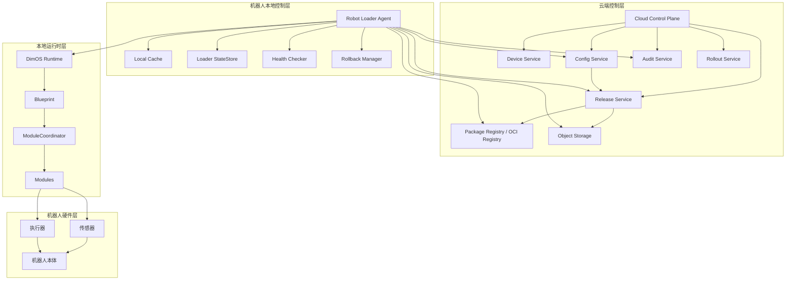

说明：

- 云端不做实时控制
- Loader 是本地部署控制器
- Runtime 是本地真实运行时

## 4. 核心对象关系图

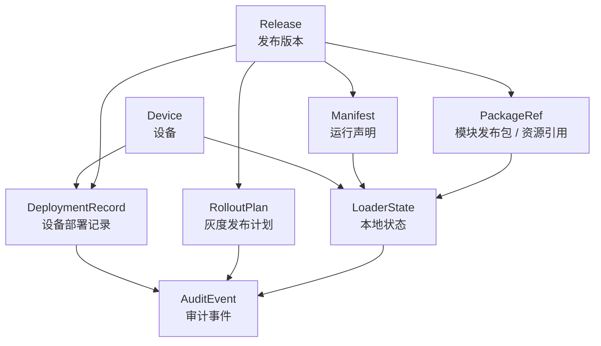

说明：

- `Manifest` 定义怎么运行
- `Release` 定义发布哪个版本
- `LoaderState` 保证本地可恢复
- `DeploymentRecord` 记录设备级结果

## 5. 配置与发布包模型图

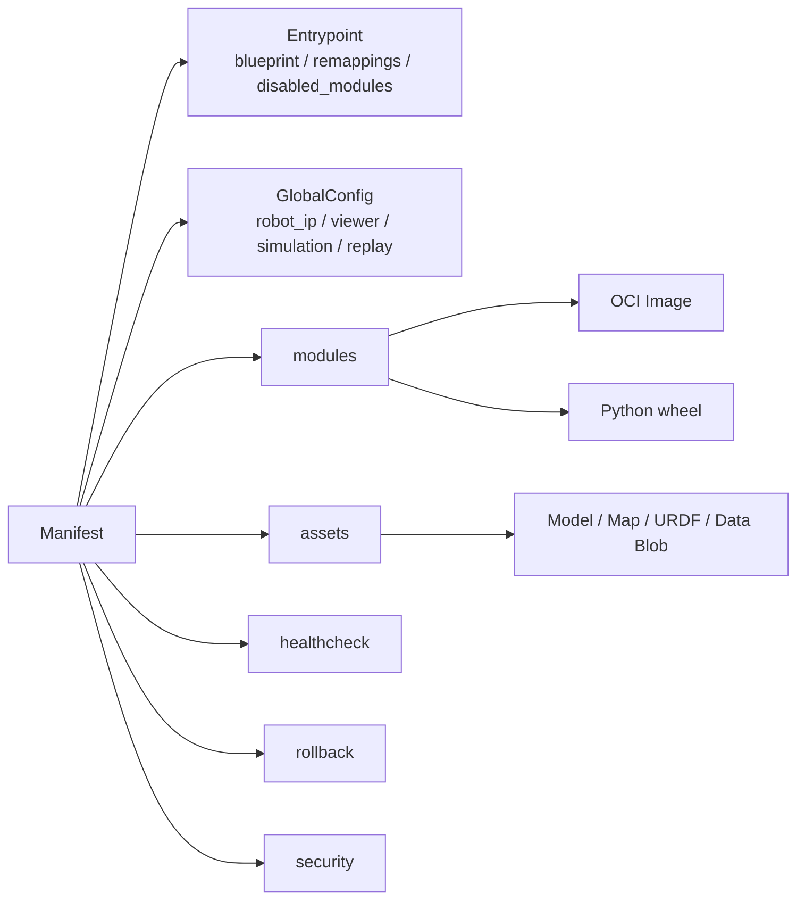

说明：

- Manifest 是云端与本地之间的核心契约
- 发布包和资源都通过 Manifest 引用

## 6. 发布包存储映射图

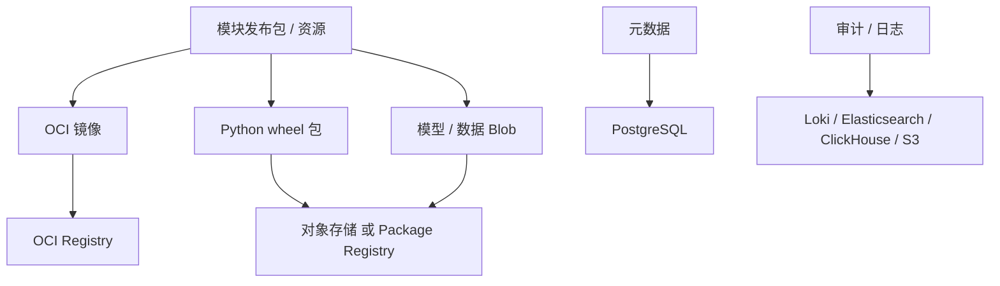

说明：

- 元数据和实际发布包分层存储
- Runtime 不直接访问云端仓库，由 Loader 统一准备

## 7. 端到端发布主流程

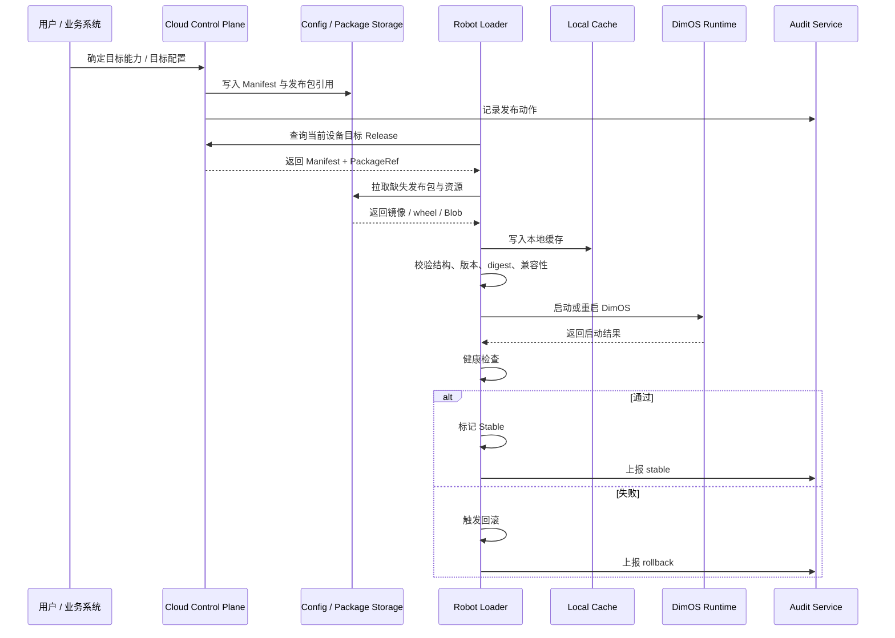

说明：

- 目标状态来源于用户 / 业务系统
- 云端负责托管和分发
- 本地负责真实执行和恢复

## 8. 本地 Loader 状态机

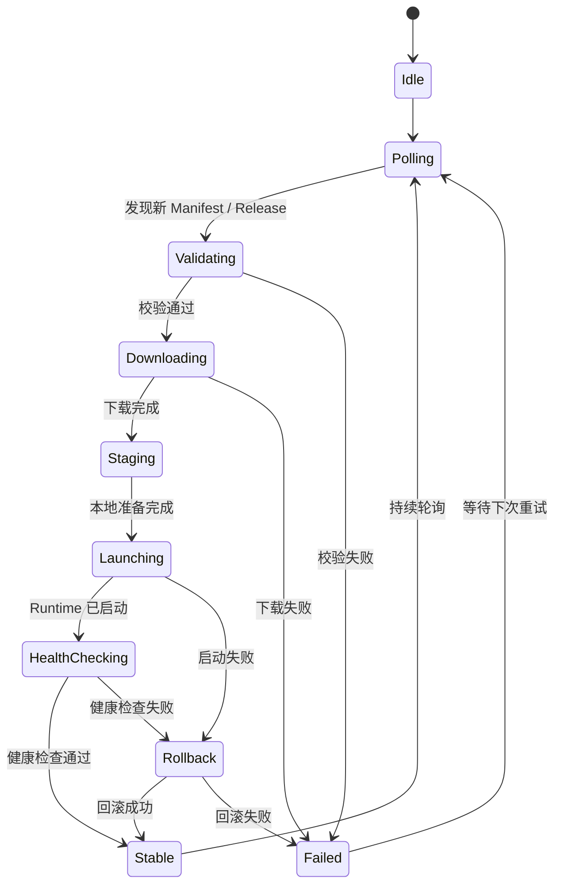

说明：

- 没通过校验不能运行
- 没通过健康检查不能标记 Stable
- 回滚必须优先依赖本地缓存

## 9. 本地执行边界图

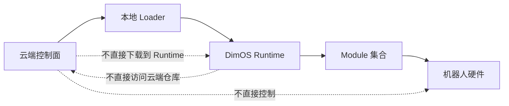

说明：

- 云端不能越过 Loader 直接控制运行时
- Runtime 不能承担供应链职责

## 10. 云端控制面分层图

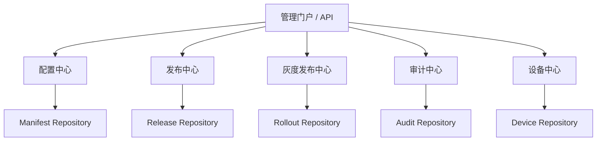

说明：

- 配置、发布、灰度、审计、设备管理建议分层建设

## 11. 灰度发布与熔断流程图

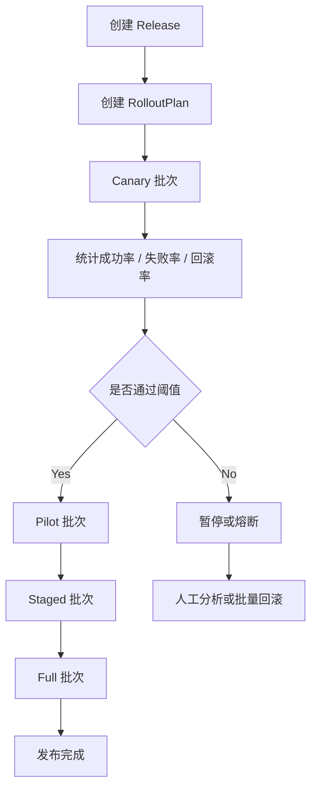

说明：

- 灰度是阶段 6 能力，不应早于基础闭环建设

## 12. 审计事件流图

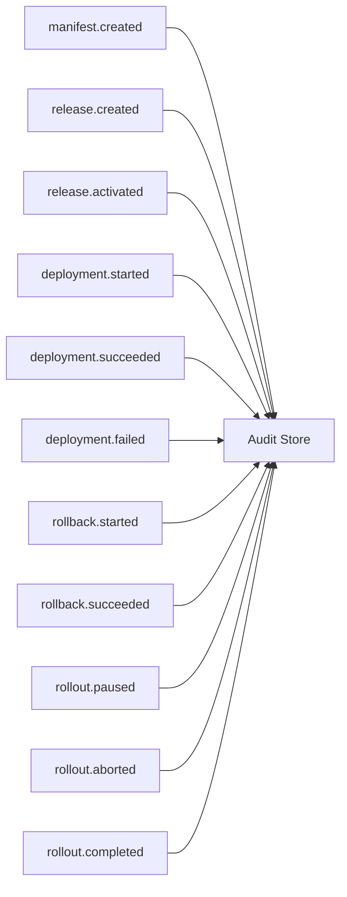

说明：

- 审计需要覆盖配置、发布、部署、回滚、灰度全过程

## 13. 分阶段实施路线图

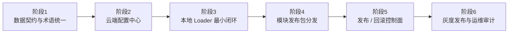

说明：

- 正确顺序是先配置，再本地闭环，再分发，再控制面，最后灰度与审计

## 14. MVP 最小落地路径

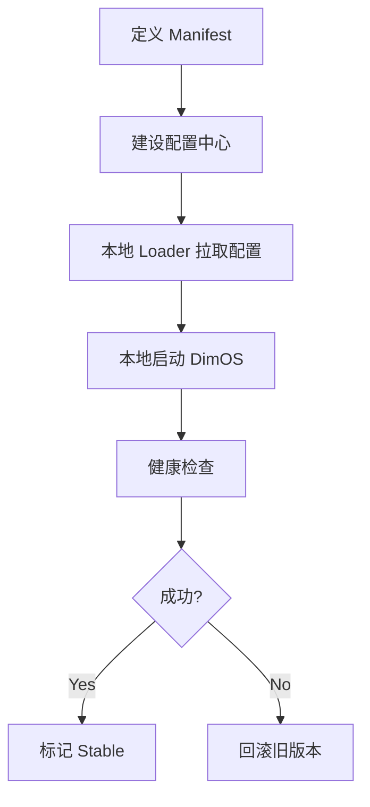

说明：

- 这是最关键的第一条闭环
- 先打通这一条，再扩展发布包和控制面

## 15. 最终目标图景

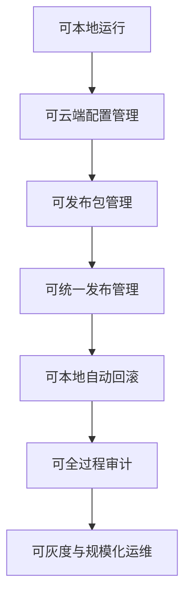

一句话总结：

> ##### DimOS 云端化不是把机器人运行搬到云端，而是把云端管理能力叠加到本地可靠运行之上，形成“可配置、可发布、可回滚、可审计、可灰度”的机器人运行平台。

