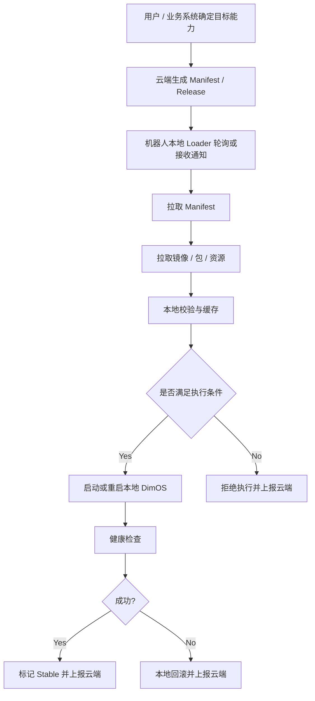
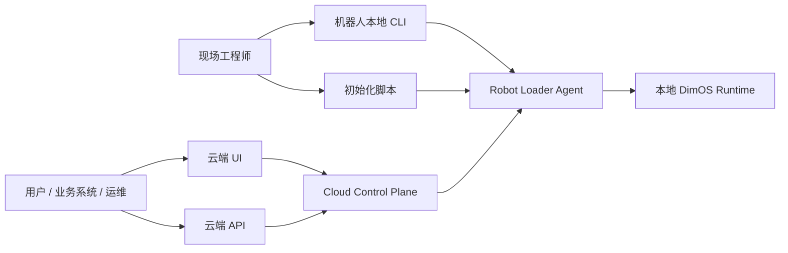

# DimOS 云端化操作方式设计：云端 UI、本地 Loader 与 CLI 分工

## 1. 文档目标

本文档专门回答一个实际落地问题：

> 机器狗如何通过本地 DimOS 获取云端配置、镜像 / 包 / 资源？这些动作到底是在云端操作，还是在机器人本地操作？是通过 UI，还是通过命令 + 脚本操作？

同时补充澄清一个关键边界：

> 云端不是机器人功能的决策者，云端只是目标状态的管理与分发平台。

本文档只讨论方案设计，不涉及具体实现代码。

## 2. 核心结论

最合理的设计不是：

- 只在云端操作
- 也不是只在机器人本地手工操作

而是：

> 用户或业务系统决定机器人需要什么能力，云端负责管理和分发这个目标状态，机器人本地负责校验、执行和恢复。

更具体地说：

- 功能决策面：`用户 / 业务系统 / 调度系统 / 本地策略`
- 云端主操作面：`UI + API`
- 机器人本地主执行面：`Robot Loader Agent`
- 机器人本地辅助操作面：`CLI / 脚本`

## 3. 四层分工

### 3.1 用户 / 业务系统：负责“决定机器人需要什么”

真正决定机器人需要加载哪些功能的，不应该是云端平台本身，而应该是：

- 用户
- 业务系统
- 调度系统
- 或机器人本地策略

它们负责给出目标状态，例如：

- 这台机器人需要运行哪个能力组合
- 这次任务需要哪些技能
- 当前设备应该切到哪个配置或版本

也就是说，这一层负责的是：

> 决定机器人需要什么功能和目标状态。

### 3.2 云端：负责“管理和分发目标状态”

云端负责：

- 保存和管理 Manifest
- 保存和管理 Release
- 保存镜像 / wheel / 模型 / 资源引用
- 选择目标设备或设备组
- 发起发布
- 发起回滚
- 查看部署状态
- 查看灰度进度
- 查看审计日志

注意：

- 云端不应自主决定机器人业务功能
- 云端只是承载和分发“已经被选定的目标状态”

也就是说，云端负责的是：

> 管理和下发“用户已经决定好的目标配置 / 版本”，并跟踪其发布状态。

### 3.3 机器人本地 Loader：负责“执行目标状态”

机器人本地需要常驻一个 `Robot Loader Agent`。

它负责：

- 查询当前设备对应的 Manifest / Release
- 拉取镜像 / wheel / 模型 / 资源
- 校验签名、digest、兼容性
- 写入本地缓存
- 启动或重启本地 DimOS
- 做健康检查
- 失败时回滚
- 向云端上报结果

更重要的是，本地 Loader 不应无条件服从云端，而应具备：

- 校验失败时拒绝执行
- 环境不兼容时拒绝执行
- 启动失败时自动回滚

也就是说，本地 Loader 负责的是：

> 把云端下发的目标状态真正执行成一套可运行系统，并保留最终执行校验权。

### 3.4 机器人本地 CLI / 脚本：负责“初始化、调试、兜底”

CLI 和脚本不应是日常发布主入口，但必须保留。

它们主要用于：

- 首次装机
- 设备注册
- 本地诊断
- 紧急手动拉取
- 紧急手动回滚
- 日志查看

也就是说，本地 CLI 负责的是：

> 保证系统在没有 UI 或需要现场排障时仍然可控。

## 4. 到底在哪里操作

### 4.1 日常发布场景

推荐在云端操作。

方式：

- 用户或运维在云端 UI 选择设备或设备组
- 选择已经确定的配置和 Release
- 点击发布
- 机器人本地 Loader 自动执行

此时机器人本地不需要人工 SSH 上去手动改配置。

### 4.2 首次初始化场景

推荐在机器人本地操作。

因为此时设备还没有纳入云端控制体系，需要先完成：

- 安装运行环境
- 安装 DimOS
- 安装 Loader
- 写入设备身份
- 配置云端地址和认证信息
- 注册设备
- 启动守护进程

### 4.3 调试和应急场景

推荐在机器人本地操作。

因为出现问题时，最可靠的方式仍然是：

- 本地查看状态
- 本地查看日志
- 本地手动拉取或回滚

## 5. 推荐的实际工作模式

### 5.1 第一次装机 / 设备接入

应由现场工程师或设备初始化流程在机器人本地完成。

推荐步骤：

1. 安装 `dimos`
2. 安装 `loader`
3. 配置 `device_id`
4. 配置云端地址
5. 配置认证信息
6. 注册设备
7. 启动 Loader 常驻服务

这个阶段适合使用：

- 本地命令
- 初始化脚本
- systemd 服务配置

### 5.2 日常配置变更 / 发布

应主要在云端完成。

推荐步骤：

1. 用户或业务系统确定目标能力组合
2. 云端将其保存为 Manifest / Release
3. 在云端 UI 指定目标设备或设备组
4. 发起发布
5. 机器人本地 Loader 自动拉取并执行
6. 云端显示设备状态、成功率、失败率、回滚情况

这个阶段适合使用：

- Web UI
- 平台 API

### 5.3 现场调试 / 紧急恢复

应允许在本地直接操作。

推荐动作：

- 查看当前版本
- 查看缓存情况
- 手动拉取指定 release
- 手动激活指定 release
- 手动回滚 stable 版本
- 查看健康状态和日志

这个阶段适合使用：

- 本地 CLI
- 本地脚本

## 6. 主链路图

说明：

- 目标状态来源于用户 / 业务系统
- 云端负责托管和分发
- 真正执行与拒绝执行都发生在机器人本地

## 7. 操作入口分工图

说明：

- UI/API 是日常主入口
- CLI/脚本是初始化和兜底入口
- Loader 是执行中心，不是云端 UI 本身

## 8. 为什么不能把云端写成“功能主导者”

如果把云端写成“决定机器人功能”的主体，会带来两个问题：

- 容易把云端误解成机器人遥控大脑
- 容易弱化本地执行校验和本地自治恢复的重要性

更合理的边界是：

- 云端管理目标状态
- 本地执行目标状态
- 用户或业务系统决定目标状态

## 9. 为什么不能只靠云端 UI

如果只靠云端 UI，会有几个问题：

- 首次设备接入无法完成
- 断网时无法恢复
- 现场排障不方便
- 本地失败时缺少直接控制手段

因此，机器人本地必须保留：

- Loader 常驻服务
- 本地 CLI
- 本地日志和状态查询能力

## 10. 为什么也不能只靠本地命令和脚本

如果只靠本地命令和脚本，会有几个问题：

- 多设备管理效率低
- 配置和版本不统一
- 发布和回滚难审计
- 灰度发布无法工程化
- 运维状态不可视化

因此，日常发布主入口仍应放在云端。

## 11. 推荐的最终方案

最合理的操作方式是：

### 11.1 功能决策入口

用于：

- 定义机器人需要什么能力
- 定义目标任务配置
- 定义目标运行版本

形式：

- 用户操作
- 业务系统调用
- 调度系统生成
- 本地策略选择

### 11.2 云端主入口

用于：

- 配置管理
- 发布管理
- 版本管理
- 灰度管理
- 审计查看

形式：

- Web UI
- 平台 API

### 11.3 本地常驻执行器

用于：

- 自动拉取
- 自动校验
- 自动缓存
- 自动启动
- 自动回滚

形式：

- Robot Loader Agent 守护进程

### 11.4 本地运维入口

用于：

- 初始化安装
- 本地排障
- 手动拉取
- 手动回滚
- 查看日志

形式：

- CLI
- 脚本

## 12. 推荐的 CLI 能力边界

本地 CLI 建议至少具备以下能力：

- `loader status`
- `loader pull <release_id>`
- `loader activate <release_id>`
- `loader rollback`
- `loader health`
- `loader logs`
- `loader register`
- `loader start`
- `loader stop`

说明：

- 这里只是能力边界建议，不代表最终命令必须采用该名字

## 13. 推荐的 UI 能力边界

云端 UI 建议至少具备以下能力：

- 创建设备
- 查看设备状态
- 创建 Manifest
- 创建 Release
- 对设备或设备组发起发布
- 查看部署结果
- 触发回滚
- 查看灰度进度
- 查看审计记录

## 14. 一句话总结

DimOS 云端化之后，最合理的操作模式不是“纯云端远程控制”，也不是“纯本地脚本维护”，而是：

> 用户或业务系统决定机器人需要什么，云端 UI / API 负责管理和分发这个目标状态，机器人本地 Loader 负责校验、执行和恢复，本地 CLI / 脚本负责初始化、调试和兜底。

这才是适合机器人系统的稳定落地方式。
