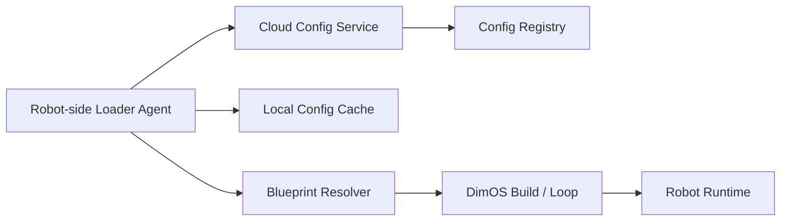
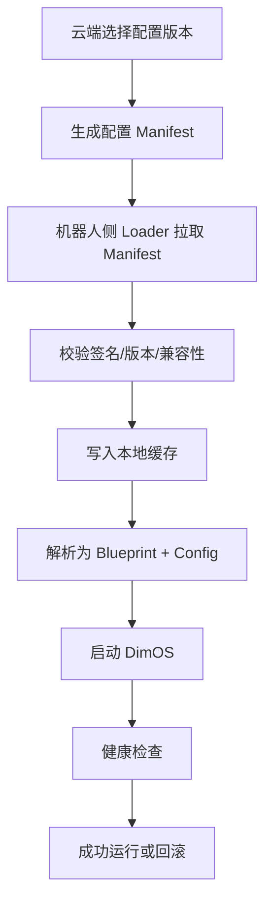

# 基于 DimOS 的云端加载配置方案

## 1. 目标

让 DimOS 支持从云端拉取运行配置，并在机器人侧本地装配和运行系统，而不是把配置固定写死在机器人本地。

一句话定义：

> 云端负责存储和下发配置，机器人侧负责拉取、校验、缓存、装配并本地运行。

## 2. 适用价值

这样做的主要价值是：

- 集中管理不同机器人的运行配置
- 灵活切换不同蓝图和模块参数
- 降低机器人本地手工改配置的成本
- 支持批量更新和版本管理
- 支持回滚到稳定配置

## 3. 基本原则

DimOS 的实时控制和模块运行，仍然放在机器人侧或边缘计算节点本地执行。

云端只负责：

- 存配置
- 发配置
- 管版本
- 做审计

不建议把云端做成实时控制面。

## 4. 推荐架构



## 5. 工作流程



## 6. 配置内容建议

云端配置建议至少包含：

- `config_version`：配置版本号
- `blueprint`：要运行的蓝图名
- `global_config`：全局参数
- `module_overrides`：模块参数覆盖
- `remappings`：流名称映射
- `disabled_modules`：禁用模块列表
- `env`：可选环境变量
- `rollback_version`：回滚目标版本

示例：

```json
{
  "config_version": "2026.03.30-go2-prod-01",
  "blueprint": "unitree-go2-agentic-mcp",
  "global_config": {
    "robot_ip": "192.168.123.161",
    "viewer": "rerun",
    "simulation": false,
    "replay": false,
    "n_workers": 8
  },
  "disabled_modules": [],
  "module_overrides": {
    "Agent": {
      "model": "gpt-4o"
    }
  },
  "remappings": [],
  "rollback_version": "2026.03.10-go2-prod-02"
}
```

## 7. 机器人侧需要增加的能力

建议新增一个本地 Loader Agent，负责：

- 从云端拉取配置
- 校验配置是否合法
- 将配置缓存到本地
- 触发 DimOS 启动或重启
- 在失败时自动回滚

这个 Loader 不负责实时控制，只负责配置生命周期管理。

## 8. 与 DimOS 现有能力的结合点

该方案与当前 DimOS 结构是匹配的：

- `GlobalConfig` 可承接全局参数
- `Blueprint` 可承接系统装配
- `autoconnect()` 可承接模块组合
- `ModuleCoordinator` 可承接本地运行

相关代码：

- `dimos/core/global_config.py`
- `dimos/core/blueprints.py`
- `dimos/core/module_coordinator.py`
- `dimos/robot/cli/dimos.py`

## 9. 关键注意事项

### 9.1 不要把云端做成实时控制面

机器人控制应继续在本地运行，避免网络抖动直接影响控制稳定性。

### 9.2 必须做版本管理

每次下发配置都应有明确版本号，方便追踪和回滚。

### 9.3 必须做本地缓存

机器人断网后，仍应能使用最近一次成功配置继续运行。

### 9.4 必须做兼容性检查

配置版本需要检查：

- DimOS 版本是否兼容
- 硬件类型是否匹配
- 依赖模块是否存在

### 9.5 必须做回滚机制

新配置启动失败时，应自动回退到上一个稳定版本。

## 10. 推荐实施顺序

建议分三步做：

1. 云端配置中心
   - 先只支持配置下发，不处理远程模块分发
2. 本地 Loader Agent
   - 支持拉取、缓存、校验、启动、回滚
3. 配置版本管理
   - 支持历史记录、灰度发布、回滚

## 11. 结论

DimOS 完全可以扩展为“云端加载配置，本地运行系统”的架构。

最合理的模式不是“云端直接控制机器人运行”，而是：

> 云端管理配置，机器人本地拉取配置并启动 DimOS。

这样既保留了本地运行的稳定性，也获得了云端统一管理的灵活性。
