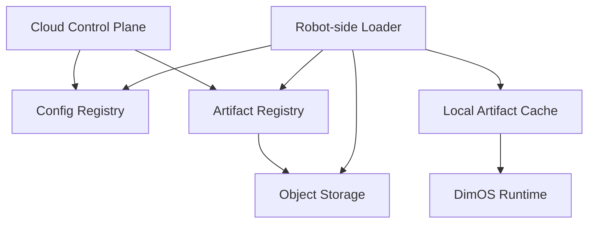
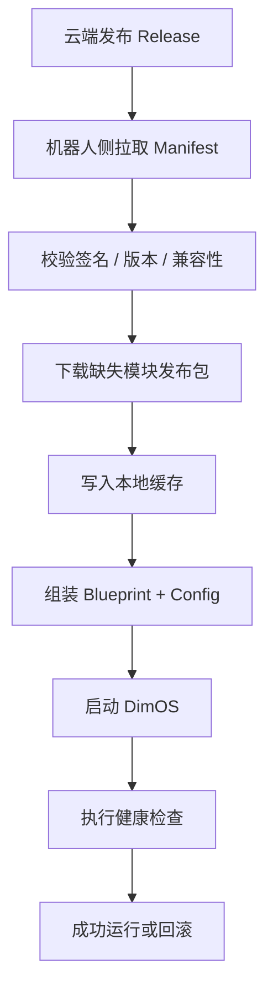
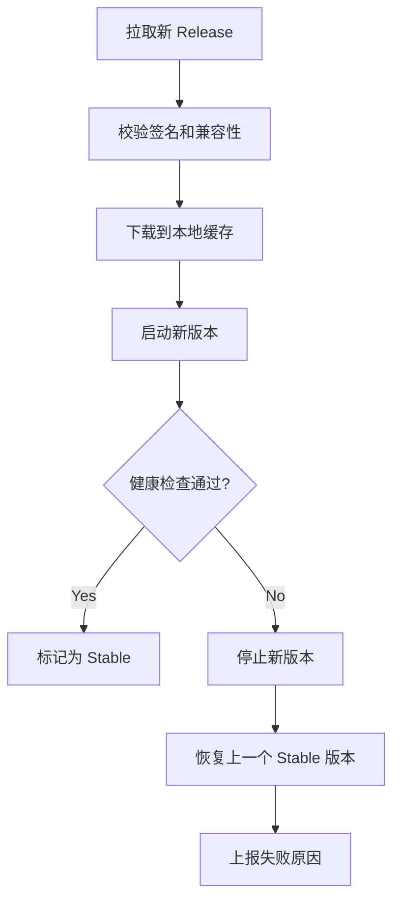

# 基于 DimOS 的云端模块分发与版本管理方案

## 1. 核心结论

对 DimOS 来说，最合理的方向不是“云端直接下发任意 Python 代码”，而是：

> 云端下发版本化配置和版本化模块发布包，机器人本地拉取、校验、缓存、装配、运行与回滚。

这比“云端动态执行代码”更安全，也更适合机器人系统。

## 2. 方案范围

本方案重点讨论：

- 云端模块分发
- 发布包管理（含镜像 / 包管理）
- 版本控制
- 回滚机制
- 云端存储

## 3. 模块分发原则

不建议做：

- 云端保存一段脚本
- 机器人下载后直接执行

建议做：

- 云端保存模块发布包
- 机器人只下载已构建、已签名、可回滚的发布包

## 4. 推荐的模块发布包类型与管理边界

这一节本质上讨论的是“发布包管理”，而不是狭义的“镜像 / 包管理”。

更准确地说：

- `镜像 / 包管理` 主要覆盖 Docker image、wheel 这类可安装或可运行包
- `发布包管理` 除了镜像和包，还包括模型、地图、URDF、静态资源等 Blob

因此，对 DimOS 来说，镜像管理和包管理是发布包管理的子集。

建议将模块发布包分为三类：

### 4.1 OCI 镜像

适合：

- 依赖复杂模块
- GPU 模块
- 重型感知或推理模块
- 独立运行的服务型模块

优势：

- 依赖封装完整
- 易于版本化
- 易于分发和回滚
- 与 DimOS 现有 DockerModule 机制兼容

### 4.2 Python wheel 包

适合：

- 轻量纯 Python 模块
- 内部扩展模块
- 对环境依赖较简单的模块

优势：

- 分发成本低
- 启动轻量
- 易于嵌入现有 Python 环境

### 4.3 模型 / 数据 Blob

适合：

- ONNX 模型
- 权重文件
- 地图文件
- URDF / MJCF
- 回放数据
- 静态资源

优势：

- 与代码版本解耦
- 可单独缓存和更新

## 5. 模块发布包类型与存储位置映射

上面一节定义的是“模块发布包类型”，下面云端存储部分定义的是“这些发布包放到哪里”。

两者对应关系如下：

| 模块发布包类型 | 典型内容 | 推荐存储位置 |
| --- | --- | --- |
| OCI 镜像 | 容器化模块 | OCI Registry |
| Python wheel 包 | 轻量 Python 安装包 | 对象存储，或独立 Package Registry |
| 模型 / 数据 Blob | ONNX、权重、地图、URDF、静态资源 | 对象存储 |

因此可以这样理解：

- 第 4 节定义“模块发布包是什么”
- 第 6.2 和 6.3 节定义“模块发布包存哪里”

## 6. DimOS 现有基础能力

当前仓库已经具备一些可复用基础：

- Docker 化模块运行基础：`dimos/core/docker_runner.py`
- 数据拉取与缓存基础：`dimos/utils/data.py`
- 本地运行注册基础：`dimos/core/run_registry.py`
- 配置装配基础：`dimos/core/global_config.py`

这意味着：

- 云端配置下发可直接落到 `GlobalConfig + Blueprint`
- 云端模块分发可优先对接 Docker 模块
- 本地运行与回滚可以利用现有运行注册机制扩展

## 7. 推荐架构



## 8. 云端存储分层建议

建议拆成四类存储：

### 8.1 元数据存储

推荐：

- PostgreSQL

存储内容：

- 配置 manifest 元数据
- 版本关系
- 设备绑定信息
- 发布记录
- 回滚记录
- 兼容性规则

### 8.2 发布包仓库

推荐：

- OCI Registry

存储内容：

- Docker 镜像
- 容器化模块

### 8.3 对象存储

推荐：

- S3 / MinIO / OSS / COS

存储内容：

- wheel 包
- ONNX / 权重文件
- 地图文件
- URDF / MJCF
- replay 数据
- 静态资源
- Manifest 原文归档
- 日志归档

### 8.4 日志与审计存储

推荐：

- Loki / Elasticsearch / ClickHouse / S3

存储内容：

- 发布日志
- 机器人拉取日志
- 失败日志
- 回滚日志
- 健康检查结果

## 9. 推荐的版本管理模型

建议同时管理四类版本：

1. `DimOS Runtime Version`
2. `Config Version`
3. `Module Package Version`
4. `Model / Data Version`

不要把这些版本混成一个值。

## 10. 推荐的发布单元

建议把一次可运行发布定义成一个 `Release`：

```json
{
  "release_id": "go2-prod-2026.03.31.001",
  "dimos_version": "0.0.11",
  "config_version": "cfg-2026.03.31.01",
  "blueprint": "unitree-go2-agentic-mcp",
  "modules": [
    {
      "name": "perception.object_tracking",
      "type": "docker",
      "version": "1.3.4",
      "digest": "sha256:..."
    },
    {
      "name": "agent.core",
      "type": "wheel",
      "version": "0.9.2"
    }
  ],
  "assets": [
    {
      "name": "go2_nav_model",
      "version": "2026.03.30",
      "uri": "s3://..."
    }
  ]
}
```

## 11. 机器人侧本地 Loader 的职责

建议新增一个 `Robot Loader Agent`，负责：

- 拉取最新 release
- 校验签名和 digest
- 下载缺失发布包
- 缓存发布包到本地
- 启动或重启 DimOS
- 执行健康检查
- 失败时回滚
- 向云端上报状态

它不是实时控制器，而是部署和生命周期管理器。

## 12. 模块拉取与运行流程



## 13. 回滚机制设计

回滚应该以“发布单元”为粒度，而不是只回滚单个文件。

机器人侧建议维护：

- 当前版本
- 上一个稳定版本
- 最近一次下载版本
- 最近一次失败版本

推荐回滚流程：



## 14. 推荐的回滚触发条件

建议至少包括：

- 进程启动失败
- 关键模块未 ready
- 关键流未建立
- 无法连接核心硬件
- 启动后短时间内异常退出
- 关键健康检查失败

## 15. 为什么回滚必须依赖本地缓存

如果回滚时仍依赖云端重新下载旧版本，那么机器人断网时就无法恢复。

因此：

- 上一个稳定版本必须保存在本地
- 回滚时优先使用本地缓存
- 云端只负责长期版本存档，不负责实时回滚依赖

## 16. 兼容性检查建议

下发 release 前，建议检查以下条件：

- `robot_type` 是否匹配
- `arch` 是否匹配，如 `x86_64` / `aarch64`
- `os` 是否匹配
- 是否需要 GPU
- `DimOS` 版本是否兼容
- 模块依赖是否满足
- 硬件驱动是否兼容

示例字段：

| 字段 | 示例 |
| --- | --- |
| `robot_type` | `unitree_go2` |
| `arch` | `aarch64` |
| `os` | `ubuntu22.04` |
| `dimos_min` | `0.0.11` |
| `dimos_max` | `0.0.x` |
| `gpu_required` | `true` |
| `transport_required` | `lcm, shm` |

## 17. 安全建议

最重要的不是“能不能发”，而是“机器人是否应该执行”。

建议至少具备：

- manifest 签名
- 发布包 digest 校验
- 白名单仓库
- 权限隔离
- secrets 与 manifest 分离

不建议把以下敏感信息直接写入 manifest：

- API Key
- root 凭据
- 长期令牌

这些内容应通过受控 secrets 机制注入。

## 18. 推荐实施顺序

建议分四步做：

1. 先做云端配置中心
   - 只下发 manifest
2. 再做 Docker 模块分发
   - 优先利用现有 DockerModule 能力
3. 再做本地缓存与回滚
   - 保证离线恢复能力
4. 最后做 wheel / 模型 / 资源 blob 管理
   - 形成完整发布包体系

## 19. 结论

对于 DimOS，最合理的云端扩展方式是：

> 云端管理版本化配置和模块发布包，机器人本地负责拉取、校验、缓存、装配、运行和回滚。

这条路线既符合 DimOS 现有架构，也能兼顾安全性、稳定性和可扩展性。


