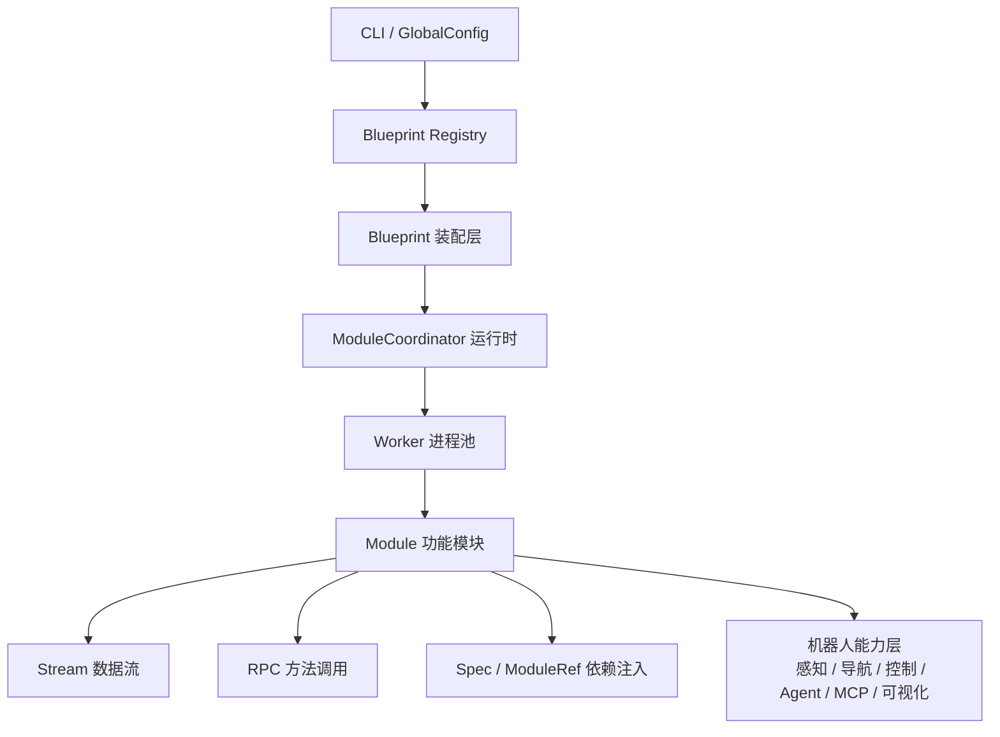
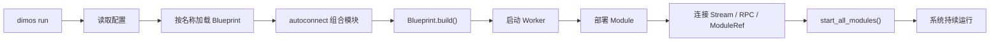

# DimOS 内部框架说明

## 1. 一句话理解

DimOS 的内部框架可以概括为：

> `CLI + 配置` 负责选系统，`Blueprint` 负责装系统，`ModuleCoordinator` 负责启动系统，`Module` 负责完成具体功能，`Stream / RPC / Spec` 负责让模块之间协作。

## 2. 自然语言说明

DimOS 不是把所有功能写进一个大程序里，而是先定义统一的运行规则，再把不同能力模块装配起来运行。

它内部可以理解为 5 层：

### 2.1 入口层

用户通过 `dimos run ...` 进入系统。  
CLI 会读取配置，并确定要运行哪个蓝图。

对应代码：

- `dimos/robot/cli/dimos.py`

### 2.2 装配层

`Blueprint` 不负责具体业务，而是负责声明“这个系统由哪些模块组成”。

例如一个 Go2 agentic 蓝图，可能同时装配：

- 机器人连接模块
- 导航模块
- 感知模块
- Agent 模块
- MCP 模块

对应代码：

- `dimos/core/blueprints.py`
- `dimos/robot/unitree/go2/blueprints/agentic/unitree_go2_agentic_mcp.py`

### 2.3 运行时层

`ModuleCoordinator` 负责启动 worker 进程、部署模块，并统一管理模块生命周期。

它相当于系统运行时调度器。

对应代码：

- `dimos/core/module_coordinator.py`

### 2.4 模块层

`Module` 是 DimOS 的最小功能单元。  
每个模块通常只负责一件事，例如：

- 相机输入
- 地图构建
- 路径规划
- 空间记忆
- Agent 推理

对应代码：

- `dimos/core/module.py`

### 2.5 协作层

模块之间通过三种机制协作：

- `Stream`：传递数据
- `RPC`：调用方法
- `Spec / ModuleRef`：做依赖注入

对应代码：

- `dimos/core/stream.py`
- `dimos/core/blueprints.py`

## 3. 分层框架图

## 4. 运行流程图

## 5. 为什么这样设计

因为机器人系统天然是多能力协同系统，不适合写成一个巨大单体。

这样设计的好处是：

- 模块化：每个模块职责单一，便于维护
- 可组合：同一套能力可以装到不同机器人上
- 易扩展：新增硬件、技能、蓝图时不需要重写整套系统
- 易复用：感知、导航、Agent 等模块可以跨平台复用
- 易切换：同一套主逻辑可以运行在真机、仿真和回放模式

## 6. 总结

DimOS 的内部框架，本质上是一套“模块化装配式机器人运行时”：

- `Module` 负责能力实现
- `Blueprint` 负责系统装配
- `ModuleCoordinator` 负责运行管理
- `Stream / RPC / Spec` 负责模块协作

它的核心目标，是把机器人系统开发从一次性工程，变成可以装配、复用和扩展的系统工程。
