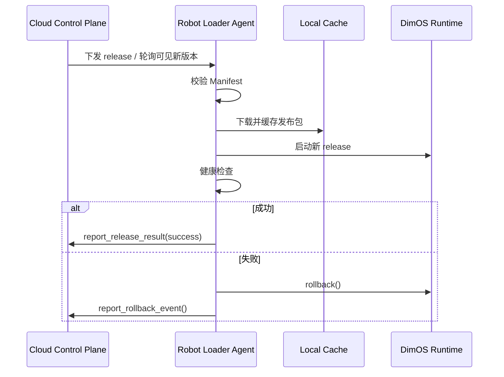

# DimOS Robot Loader Agent 与发布 / 回滚 API 方案设计

## 1. 目标

本文继续沿着云端发布体系往下设计，聚焦两部分：

- `Robot Loader Agent` 接口设计
- 发布 / 回滚 API 方案设计

本文只讨论方案，不涉及具体实现代码。

## 2. 设计边界

这一层的职责不是机器人实时控制，而是：

- 拉取 Manifest
- 下载发布包
- 管理本地缓存
- 启动和停止 DimOS
- 执行健康检查
- 回滚到稳定版本
- 向云端汇报状态

因此，Loader 更像“本地部署与生命周期管理器”。

## 3. Robot Loader Agent 角色定义

建议把 `Robot Loader Agent` 看作机器人本地的一层控制代理。

它处在：

- 云端发布控制面
- 本地 DimOS Runtime

之间。

其核心职责：

- 面向云端：接收发布意图、上报状态
- 面向本地：执行下载、装配、启动、健康检查和回滚

## 4. Robot Loader Agent 内部模块建议

建议内部拆成以下逻辑组件：

- `ManifestClient`
  - 从云端拉取 Manifest
- `ArtifactFetcher`
  - 下载镜像、wheel、blob
- `CacheManager`
  - 管理本地缓存与稳定版本
- `RuntimeController`
  - 启停 DimOS
- `HealthChecker`
  - 负责本地健康检查
- `RollbackManager`
  - 负责回滚决策与执行
- `StatusReporter`
  - 向云端上报状态
- `StateStore`
  - 持久化本地状态

## 5. Robot Loader Agent 接口设计

接口建议分三类：

- 本地控制接口
- 本地状态接口
- 云端同步接口

## 5.1 本地控制接口

这些接口由本机管理服务、运维工具或测试系统调用。

### `check_for_update()`

用途：

- 查询云端是否有新的 release

返回：

- 当前版本
- 最新版本
- 是否需要更新

### `pull_release(release_id)`

用途：

- 拉取指定 release 的 Manifest 和发布包到本地缓存

返回：

- 下载结果
- 缺失发布包列表
- 校验结果

### `stage_release(release_id)`

用途：

- 将 release 准备到本地 staged 状态
- 不立即切换运行版本

### `activate_release(release_id)`

用途：

- 启动指定 release
- 触发健康检查

### `rollback(to_release_id=None)`

用途：

- 回滚到指定 release
- 未指定时默认回滚到最近稳定版本

### `stop_runtime()`

用途：

- 停止当前运行中的 DimOS Runtime

### `restart_runtime()`

用途：

- 使用当前激活 release 重新启动 DimOS

## 5.2 本地状态接口

这些接口用于查询当前机器人上的运行态。

### `get_loader_state()`

返回：

- 当前状态机状态
- 当前 release
- 稳定 release
- 最近失败 release
- 最近一次轮询时间

### `get_runtime_state()`

返回：

- DimOS 是否运行中
- run_id
- PID
- blueprint
- 启动时间

### `list_cached_releases()`

返回：

- 本地已缓存 release 列表
- 各 release 的状态
- 是否可回滚

### `get_health_report()`

返回：

- 模块健康状态
- 流和 RPC 检查结果
- 最近一次失败原因

## 5.3 云端同步接口

这些接口用于机器人主动向云端汇报。

### `report_heartbeat()`

上报：

- `device_id`
- 当前 release
- 当前状态
- 当前健康状态
- 当前时间

### `report_release_result()`

上报：

- release_id
- 成功 / 失败
- 失败原因
- 健康检查结果

### `report_rollback_event()`

上报：

- 回滚前版本
- 回滚后版本
- 回滚原因
- 回滚时间

## 6. 建议的本地状态对象

建议 Loader 本地维护一个明确状态对象：

```json
{
  "device_id": "go2-001",
  "state": "Stable",
  "current_release": "go2-prod-2026.03.31.001",
  "stable_release": "go2-prod-2026.03.20.002",
  "staged_release": "go2-prod-2026.04.01.001",
  "last_failed_release": "go2-prod-2026.03.31.000",
  "last_error": null,
  "last_poll_at": "2026-03-31T10:10:00Z"
}
```

## 7. RuntimeController 需要控制什么

`RuntimeController` 不应该直接重写 DimOS 核心逻辑，而是包装现有运行入口。

建议职责：

- 生成本地运行参数
- 调用 `dimos run <blueprint>` 或等价本地入口
- 读取 run registry
- 管理 stop / restart
- 关联 release_id 与 run_id

这与现有 DimOS 的运行注册能力是吻合的。

## 8. HealthChecker 设计建议

健康检查建议分三层：

### 8.1 启动层检查

- 进程是否拉起
- worker 是否启动
- run registry 是否写入

### 8.2 模块层检查

- 关键模块是否 ready
- 指定模块是否存在
- 指定 RPC 是否可调用

### 8.3 功能层检查

- 关键 stream 是否建立
- 关键模块是否有数据流动
- 关键功能是否可访问

## 9. 发布 API 设计

云端发布面建议提供“控制面 API”，而不是直接暴露底层存储。

## 9.1 创建 Release

`POST /api/releases`

用途：

- 创建一个新的 release 元数据记录
- 绑定 Manifest
- 绑定发布包版本

请求示例：

```json
{
  "release_id": "go2-prod-2026.04.01.001",
  "manifest_uri": "s3://dimos-releases/go2-prod-2026.04.01.001/manifest.json",
  "target_selector": {
    "robot_type": "unitree_go2",
    "labels": ["prod"]
  }
}
```

## 9.2 发布 Release 到设备

`POST /api/releases/{release_id}/deploy`

用途：

- 把 release 发布给指定设备或设备组

请求示例：

```json
{
  "devices": ["go2-001", "go2-002"],
  "mode": "rolling"
}
```

## 9.3 查询 Release 状态

`GET /api/releases/{release_id}`

返回：

- release 元数据
- 部署进度
- 成功设备数
- 失败设备数

## 9.4 查询设备部署状态

`GET /api/devices/{device_id}/deployment`

返回：

- 当前 release
- 稳定 release
- 当前状态
- 最近一次错误

## 10. 回滚 API 设计

回滚 API 应该显式表达“回滚到哪个版本”和“为什么回滚”。

## 10.1 触发单设备回滚

`POST /api/devices/{device_id}/rollback`

请求示例：

```json
{
  "to_release_id": "go2-prod-2026.03.20.002",
  "reason": "healthcheck_failed"
}
```

## 10.2 触发批量回滚

`POST /api/releases/{release_id}/rollback`

用途：

- 将某次发布影响的设备批量回滚

请求示例：

```json
{
  "device_selector": {
    "labels": ["prod"]
  },
  "reason": "global_release_issue"
}
```

## 10.3 查询回滚事件

`GET /api/rollbacks`

支持按以下条件过滤：

- `device_id`
- `release_id`
- 时间范围
- 回滚原因

## 11. 建议的状态返回模型

发布或回滚接口建议统一返回标准状态模型：

```json
{
  "request_id": "req-123",
  "device_id": "go2-001",
  "release_id": "go2-prod-2026.04.01.001",
  "status": "accepted",
  "message": "Deployment request accepted"
}
```

统一状态值建议：

- `accepted`
- `in_progress`
- `stable`
- `failed`
- `rolled_back`

## 12. 推荐的异常分类

Loader 和云端 API 建议统一错误语义：

- `ManifestValidationError`
- `ArtifactDownloadError`
- `CompatibilityError`
- `RuntimeLaunchError`
- `HealthcheckError`
- `RollbackError`

这样可以统一：

- 本地状态
- 云端审计
- 失败统计

## 13. 推荐的接口调用流程



## 14. 设计原则总结

Loader 与发布 API 的核心设计原则是：

- 控制面和运行面分离
- 本地执行启动与回滚
- 云端负责发布、审计和编排
- 所有状态可追踪
- 所有失败可分类

## 15. 结论

`Robot Loader Agent` 的价值，不是替代 DimOS Runtime，而是给 DimOS 增加一层稳定的本地部署控制能力。

发布 / 回滚 API 的价值，不是直接远程操控机器人，而是把发布、追踪、失败处理和回滚流程标准化。

这两层补上之后，DimOS 就能从“本地运行时”进一步演化为“可被云端安全发布和管理的机器人运行平台”。


