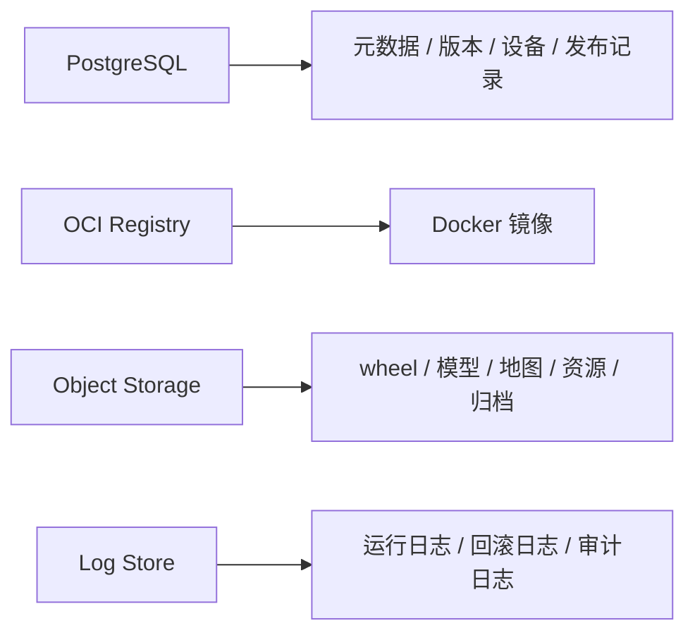
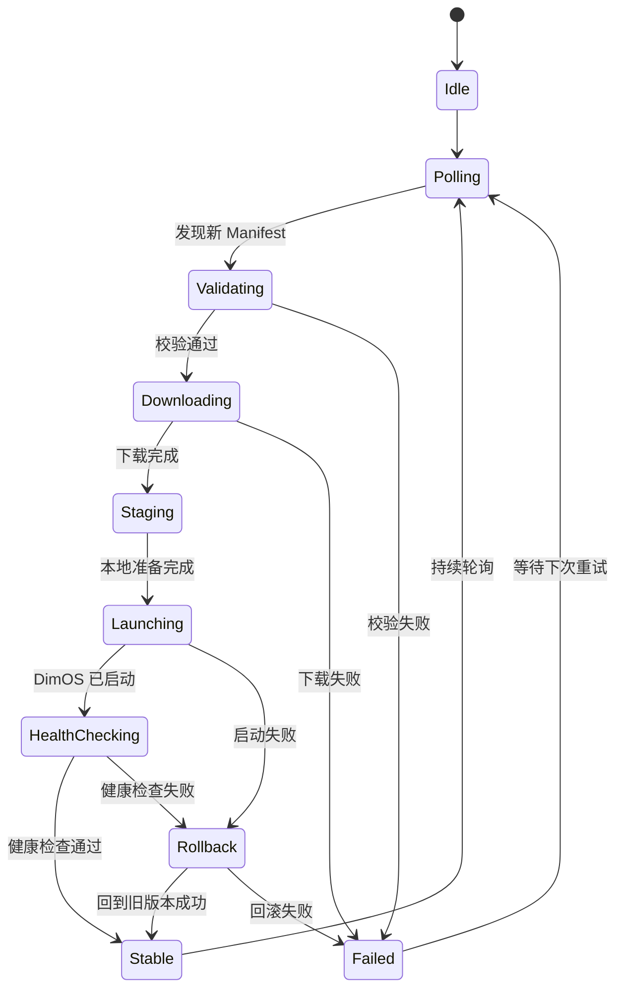

# DimOS 云端 Manifest、存储与 Loader 状态机设计

## 1. 目标

本文聚焦三部分：

- Manifest 详细结构设计
- 云端存储里的对象该分别存什么
- 机器人侧 Loader 的状态机设计

目标是为 DimOS 的云端发布与本地运行体系提供一个可落地的设计骨架。

## 2. Manifest 详细结构设计

建议把 `Manifest` 设计成“可直接驱动一次本地部署”的最小发布单元。

不要只放 blueprint 名称，而是把运行所需的关键约束、发布包、健康检查和回滚信息一并带上。

### 2.1 推荐结构

```json
{
  "manifest_version": "1.0",
  "release_id": "go2-prod-2026.03.31.001",
  "created_at": "2026-03-31T10:00:00Z",
  "target": {
    "robot_type": "unitree_go2",
    "device_id": "go2-001",
    "arch": "aarch64",
    "os": "ubuntu22.04"
  },
  "runtime": {
    "dimos_min": "0.0.11",
    "dimos_max": "0.0.x",
    "python": "3.12"
  },
  "entrypoint": {
    "blueprint": "unitree-go2-agentic-mcp",
    "disabled_modules": [],
    "remappings": []
  },
  "global_config": {
    "robot_ip": "192.168.123.161",
    "viewer": "rerun",
    "simulation": false,
    "replay": false,
    "n_workers": 8
  },
  "modules": [
    {
      "name": "perception.object_tracking",
      "type": "docker",
      "source": "registry.company/dimos/object-tracking:1.3.4",
      "version": "1.3.4",
      "digest": "sha256:abc",
      "required": true,
      "config": {}
    },
    {
      "name": "agent.core",
      "type": "wheel",
      "source": "s3://dimos-artifacts/wheels/agent_core-0.9.2-py3-none-any.whl",
      "version": "0.9.2",
      "sha256": "def",
      "required": true,
      "config": {
        "model": "gpt-4o"
      }
    }
  ],
  "assets": [
    {
      "name": "go2_nav_model",
      "type": "blob",
      "uri": "s3://dimos-artifacts/models/go2_nav/2026.03.30/model.onnx",
      "version": "2026.03.30",
      "sha256": "xyz",
      "mount_to": "/opt/dimos/models/go2_nav/model.onnx"
    }
  ],
  "healthcheck": {
    "startup_timeout_sec": 60,
    "required_modules": ["Agent", "McpServer"],
    "required_streams": ["color_image"],
    "required_rpc": ["server_status"]
  },
  "rollback": {
    "previous_stable_release": "go2-prod-2026.03.20.002",
    "allow_auto_rollback": true
  },
  "security": {
    "manifest_signature": "base64-signature",
    "trusted_registries": ["registry.company"],
    "secrets_profile": "go2-prod"
  }
}
```

### 2.2 字段含义建议

- `target`
  - 限定这份 manifest 能发给哪些设备
- `runtime`
  - 限定兼容的 DimOS、Python、OS 版本
- `entrypoint`
  - 定义从哪个 blueprint 起系统
- `global_config`
  - 承载全局运行参数
- `modules`
  - 描述需要拉取和运行的模块发布包
- `assets`
  - 描述模型、地图等非代码资源
- `healthcheck`
  - 定义系统是否算“启动成功”
- `rollback`
  - 定义回滚策略
- `security`
  - 定义签名、白名单和 secret 策略

### 2.3 设计原则

Manifest 设计建议遵循：

- 可复现：同一个 manifest 在相同环境中应得到相同结果
- 可校验：每个发布包都应有 digest 或 checksum
- 可约束：必须能表达目标设备和运行环境边界
- 可回滚：必须能指向上一个稳定版本
- 可审计：必须保留版本、时间和来源信息

## 3. 云端存储对象设计

建议把“元数据”和“实际文件”分开存储。

## 3.1 数据库存储

适合用 PostgreSQL 等关系型数据库。

建议存储：

- 机器人设备信息
  - `device_id`
  - `robot_type`
  - `arch`
  - `os`
  - 当前稳定版本
- Manifest 元数据
  - `release_id`
  - `config_version`
  - 目标设备范围
  - 创建时间
  - 状态
- 发布记录
  - 发布人
  - 发布时间
  - 发布到哪些设备
- 回滚事件
  - 哪台机器人
  - 从哪个版本回滚到哪个版本
  - 失败原因
- 兼容性矩阵
  - 模块支持哪些设备和系统

## 3.2 OCI Registry 存储

适合存容器镜像。

建议存储：

- 感知模块镜像
- 推理模块镜像
- 服务型模块镜像
- GPU 模块镜像

示例：

- `registry.company/dimos/object-tracking:1.3.4`
- `registry.company/dimos/vlm-server:2.1.0`

## 3.3 对象存储

适合用 S3 / MinIO / OSS / COS。

建议存储：

- wheel 包
- ONNX / 权重文件
- 地图
- URDF / MJCF
- replay 数据
- 静态资源
- Manifest 原文归档
- 日志归档

## 3.4 日志系统

适合用 Loki / Elasticsearch / ClickHouse。

建议存储：

- Loader 拉取日志
- 启动日志
- 健康检查失败日志
- 回滚日志
- 模块下载失败日志

### 3.5 存储职责示意



## 4. 机器人侧 Loader 状态机设计

建议把 Loader 做成明确状态机，而不是简单脚本。

这样才能具备：

- 可恢复
- 可回滚
- 可观测
- 可扩展

### 4.1 推荐状态机



### 4.2 各状态职责

- `Idle`
  - 当前没有更新任务
- `Polling`
  - 定时检查云端是否有新 manifest
- `Validating`
  - 校验签名、版本、兼容性和白名单
- `Downloading`
  - 拉取缺失发布包到本地缓存
- `Staging`
  - 准备目录、环境变量、secret、配置文件
- `Launching`
  - 启动或重启 DimOS
- `HealthChecking`
  - 检查关键模块、关键流和关键 RPC
- `Stable`
  - 标记当前 release 为稳定版本
- `Rollback`
  - 恢复上一个稳定版本
- `Failed`
  - 记录错误，等待人工或自动重试

### 4.3 三条关键规则

- 没通过 `Validating`，绝不下载和运行
- 没通过 `HealthChecking`，绝不标记为 `Stable`
- `Rollback` 必须优先依赖本地缓存，而不是依赖云端

## 5. 推荐的本地目录结构

```text
/var/lib/dimos-loader/
  manifests/
  cache/
    docker/
    wheels/
    blobs/
  releases/
    current
    stable
    staged
  state/
    loader_state.json
    rollback_history.json
  logs/
```

## 6. 推荐的本地状态文件

```json
{
  "device_id": "go2-001",
  "current_release": "go2-prod-2026.03.31.001",
  "stable_release": "go2-prod-2026.03.20.002",
  "last_failed_release": "go2-prod-2026.03.31.000",
  "last_poll_at": "2026-03-31T10:10:00Z",
  "state": "Stable"
}
```

## 7. 最务实的实施顺序

建议按以下顺序推进：

1. 先定 Manifest 结构
2. 再定 Loader 状态机
3. 再补云端存储映射
4. 最后实现发布、健康检查和回滚

## 8. 结论

对 DimOS 来说，云端发布体系要想落地，最核心的三件事是：

- 用 Manifest 定义一次可复现部署
- 用分层存储管理元数据和发布包
- 用本地 Loader 状态机保证下载、启动、健康检查和回滚可控

这样才能把“云端发布”真正变成“本地可安全运行的机器人系统”。


