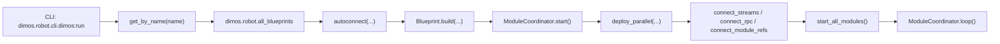

# DimOS 项目根目录扫描报告（第一阶段）

## 1. 扫描范围与方法

- 扫描范围：仓库根目录、`pyproject.toml`、`README.md`、CLI 入口、蓝图注册、核心运行时与代表性蓝图。
- 扫描原则：仅基于当前工作区源码与现有文档信号，不使用臆测。
- 当前工作区状态：`git status --short` 显示 `assets/`、`docs/` 存在大量未提交删除项，本报告不对这些变更做回滚或修复。

## 2. 根目录结构概览

### 2.1 顶层目录

| 路径 | 角色判断 | 证据 |
| --- | --- | --- |
| `dimos/` | 主代码包，系统内核与所有机器人能力实现均在此 | `pyproject.toml` 的 `tool.setuptools.packages.find.include = ["dimos*"]` |
| `data/` | 运行/示例/模型相关数据资产 | 根目录扫描结果 |
| `docker/` | Docker 化运行与模块封装 | 根目录扫描结果；`pyproject.toml` 存在 `docker` extra |
| `examples/` | 最小示例与语言互操作样例 | 根目录扫描结果 |
| `bin/` | 测试/辅助执行脚本 | 根目录扫描结果 |
| `.github/` | CI/CD 与仓库自动化 | 根目录扫描结果 |
| `.devcontainer/` | 开发容器环境 | 根目录扫描结果 |
| `scripts/` | 安装脚本等辅助工具 | `README.md` 引用 `scripts/install.sh` |

### 2.2 代码包一级子系统规模

`dimos/` 下共约 `953` 个文件。按一级目录粗略统计：

| 子系统 | 文件数 | 初步职责判断 |
| --- | ---: | --- |
| `robot/` | 116 | 各机器人平台接入、蓝图、CLI 注册 |
| `msgs/` | 81 | 类型化消息定义 |
| `perception/` | 74 | 检测、跟踪、空间/时间记忆 |
| `web/` | 72 | Web 交互与可视化服务 |
| `hardware/` | 64 | 相机、雷达等硬件驱动 |
| `agents/` | 55 | Agent、MCP、技能系统 |
| `core/` | 53 | Module/Blueprint/Worker/Transport 内核 |
| `manipulation/` | 53 | 机械臂规划、抓取、操作任务 |
| `utils/` | 51 | CLI、日志、数据工具 |
| `protocol/` | 50 | RPC、PubSub、TF、协议适配 |

## 3. 项目入口与运行主链路

### 3.1 安装与入口

- Python 包名：`dimos`
- 版本：`0.0.11`
- Python 要求：`>=3.10`
- CLI 入口：`dimos = "dimos.robot.cli.dimos:main"`，定义于 `pyproject.toml`

### 3.2 运行时主链路

从 `dimos run <blueprint>` 进入后的主路径已确认：

关键证据：

- CLI 入口与 `run()`：`dimos/robot/cli/dimos.py`
- 蓝图按名称解析：`dimos/robot/get_all_blueprints.py`
- 蓝图注册表：`dimos/robot/all_blueprints.py`
- 构建与连接：`dimos/core/blueprints.py`
- Worker 启动与模块生命周期：`dimos/core/module_coordinator.py`

### 3.3 当前识别出的运行模型

- 系统基本计算单元：`Module`
- 系统编排单元：`Blueprint`
- 通信模型：类型化 `In[T] / Out[T]` 数据流 + RPC + Spec 注入
- 进程模型：`ModuleCoordinator` 管理多个 worker；模块被并行部署并统一启动

## 4. 初步逻辑/物理拓扑信号

虽然第一阶段未进入完整部署拓扑绘制，但已确认以下系统级通信面：

| 通信/接口 | 形态 | 证据 |
| --- | --- | --- |
| LCM / pLCM | 内部默认流式总线 | `dimos/core/blueprints.py`, `dimos/core/transport.py` |
| SHM / pSHM | 高频图像/大对象共享内存 | `dimos/core/transport.py`, `dimos/robot/unitree/go2/blueprints/basic/unitree_go2_basic.py` |
| ROS / DDS | 可选外部中间件桥接 | `dimos/core/transport.py`, `pyproject.toml` 中 `dds` extra |
| HTTP JSON-RPC MCP | Agent 工具暴露面 | `dimos/agents/mcp/mcp_server.py` |
| WebSocket / Web UI | 可视化与输入 | `dimos/web/websocket_vis/websocket_vis_module.py`, `dimos/agents/web_human_input.py` |
| Unitree WebRTC | 四足/人形真机连接 | `GlobalConfig.unitree_connection_type`, `pyproject.toml` 中 `unitree` extra |
| MAVLink / UDP | 无人机真机/回放连接 | `dimos/robot/drone/blueprints/basic/drone_basic.py` |
| MuJoCo | 仿真运行面 | `pyproject.toml` 中 `sim` extra, `GlobalConfig.simulation` |

## 5. 蓝图与模块规模事实

- 已注册蓝图数：`76`
- 已注册独立模块数：`55`
- 代表性蓝图显示该仓库不是单一应用，而是一个“机器人 OS + 蓝图库 + 能力组件库”：
  - `unitree-go2`
  - `unitree-go2-agentic`
  - `unitree-go2-agentic-mcp`
  - `unitree-g1-agentic-sim`
  - `drone-agentic`
  - `xarm-perception-agent`
  - `dual-xarm6-planner`

证据：`dimos/robot/all_blueprints.py`

## 6. 初步识别的核心功能块清单

以下为基于目录规模、入口链路、蓝图组合与依赖结构得到的第一版核心功能块识别：

### 6.1 模块运行时内核

- 核心职责：定义模块生命周期、流连接、RPC、worker 进程协调。
- 关键文件：
  - `dimos/core/module.py`
  - `dimos/core/blueprints.py`
  - `dimos/core/module_coordinator.py`
  - `dimos/core/transport.py`
- 判断理由：所有蓝图最终都收敛到这套运行时；这是全系统最底层公共基座。

### 6.2 蓝图编排与运行注册

- 核心职责：将机器人连接、感知、导航、Agent、可视化按蓝图组合成可运行栈。
- 关键文件：
  - `dimos/robot/cli/dimos.py`
  - `dimos/robot/get_all_blueprints.py`
  - `dimos/robot/all_blueprints.py`
- 判断理由：`dimos run` 的唯一系统装配入口在此。

### 6.3 移动机器人自主导航与建图

- 核心职责：围绕 Go2/G1 等移动平台完成体素地图、代价地图、A* 重规划、前沿探索。
- 关键文件：
  - `dimos/robot/unitree/go2/blueprints/smart/unitree_go2.py`
  - `dimos/mapping/voxels.py`
  - `dimos/mapping/costmapper.py`
  - `dimos/navigation/replanning_a_star/module.py`
  - `dimos/navigation/frontier_exploration/wavefront_frontier_goal_selector.py`
- 判断理由：`unitree-go2` 是 README 的主打运行栈之一，且直接由这些模块构成。

### 6.4 感知与空间/时间记忆

- 核心职责：检测、跟踪、3D 感知、空间记忆、时间记忆与感知循环技能。
- 关键文件：
  - `dimos/perception/`
  - `dimos/perception/spatial_perception.py`
  - `dimos/perception/experimental/temporal_memory/temporal_memory.py`
  - `dimos/perception/perceive_loop_skill.py`
- 判断理由：`unitree_go2_spatial` 在导航栈之上显式叠加 `spatial_memory()` 与 `PerceiveLoopSkill`。

### 6.5 Agent / Skill / MCP 智能体控制面

- 核心职责：把机器人技能暴露给 LLM，支持进程内 Agent 与 HTTP MCP 两种工具调用路径。
- 关键文件：
  - `dimos/agents/agent.py`
  - `dimos/agents/mcp/mcp_client.py`
  - `dimos/agents/mcp/mcp_server.py`
  - `dimos/agents/skills/`
  - `dimos/robot/unitree/go2/blueprints/agentic/unitree_go2_agentic_mcp.py`
- 判断理由：README 与 AGENTS 说明都把 Agent/MCP 作为核心卖点，且存在独立蓝图与协议实现。

### 6.6 机器人平台适配层

- 核心职责：接入具体硬件或仿真平台，包括四足、人形、无人机、机械臂。
- 关键文件：
  - `dimos/robot/unitree/`
  - `dimos/robot/drone/`
  - `dimos/robot/manipulators/`
  - `dimos/simulation/`
- 判断理由：平台适配目录体量最大，且蓝图命名明显围绕平台展开。

### 6.7 机械臂规划与操作

- 核心职责：关节/笛卡尔规划、抓取、放置、协调控制、双臂场景。
- 关键文件：
  - `dimos/manipulation/blueprints.py`
  - `dimos/manipulation/manipulation_module.py`
  - `dimos/manipulation/pick_and_place_module.py`
  - `dimos/control/`
- 判断理由：`manipulation/` 与 `control/` 共同组成另一条明显的主业务线。

### 6.8 可视化、Web 输入与遥操作

- 核心职责：Rerun/Foxglove 可视化、WebSocket 可视化、网页输入、Quest/Phone/Keyboard Teleop。
- 关键文件：
  - `dimos/web/websocket_vis/websocket_vis_module.py`
  - `dimos/visualization/rerun/`
  - `dimos/teleop/`
  - `dimos/agents/web_human_input.py`
- 判断理由：多类蓝图默认携带可视化或遥操作部件，例如 `unitree_go2_basic`、`drone_basic`。

## 7. 当前阶段的 Top 3 核心业务主线

如果按“项目最有代表性的业务价值”排序，当前更像是以下三条主线：

1. 移动机器人自主运行栈
   - 代表：`unitree-go2`, `unitree-g1`, `drone-basic`
   - 特征：硬件连接 + 感知 + 建图 + 导航 + 可视化

2. Agent 化机器人控制
   - 代表：`unitree-go2-agentic`, `unitree-go2-agentic-mcp`, `drone-agentic`
   - 特征：自然语言输入、技能编排、LLM 调用、MCP 工具暴露

3. 机械臂规划与操作
   - 代表：`xarm-perception-agent`, `dual-xarm6-planner`, `xarm7-trajectory-sim`
   - 特征：规划、抓取、场景理解、协调控制

## 8. 下一阶段建议

下一轮深度分析应优先展开这三条链路：

1. `dimos run unitree-go2-agentic-mcp` 的完整运行链
2. `unitree-go2` 导航/建图主链
3. `xarm-perception-agent` 的操作闭环

这样可以同时覆盖：

- 系统内核
- 移动平台主业务
- Agent/MCP 协议面
- Manipulation 第二业务线
